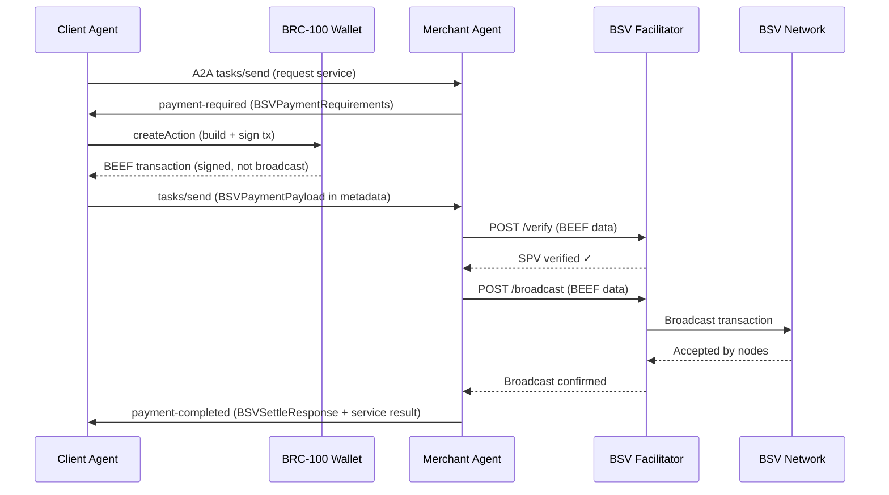

# A2A-BSV: BSV Payment Scheme for Agent-to-Agent Commerce

<p align="center">
  <strong>Bringing sub-cent micropayments to AI agent-to-agent commerce via the x402 protocol</strong>
</p>

<p align="center">
  <a href="docs/PRD.md">Full PRD & Spec</a> •
  <a href="#quick-start">Quick Start</a> •
  <a href="#architecture">Architecture</a> •
  <a href="#roadmap">Roadmap</a>
</p>

---

## Quick Start: Set Up Your Agent for BSV Payments

Complete instructions for getting any Clawdbot paying and receiving BSV. Takes ~5 minutes.

### Prerequisites
- **Node.js v18+** and **npm**
- A running **Clawdbot** instance (any channel — Telegram, Signal, etc.)

### Step 1: Clone the repo

```bash
git clone https://github.com/galt-tr/a2a-bsv.git
cd a2a-bsv
```

### Step 2: Build and create wallet

```bash
bash skills/bsv-pay/scripts/setup.sh
```

This does everything:
- Installs dependencies (`@bsv/sdk`, `@bsv/wallet-toolbox`)
- Builds the `@a2a-bsv/core` TypeScript library
- Creates a BSV **testnet** wallet at `~/.clawdbot/bsv-wallet/`
- Displays your agent's **identity key** (compressed public key)

You'll see output like:
```
✅ Wallet created!
Identity key: 035b72582b840f5cf86b8f...
```

Save that identity key — other agents need it to send you payments.

### Step 3: Get your testnet receive address

```bash
cd a2a-bsv
NODE_PATH=$(pwd)/packages/core/node_modules node skills/bsv-pay/scripts/bsv-agent-cli.mjs address
```

Output:
```json
{
  "success": true,
  "data": {
    "address": "mvFheDXoNgzC4ffjaqz18ALZ9igx26Q9Y7",
    "network": "testnet",
    "identityKey": "035b72...",
    "note": "Fund this address at https://witnessonchain.com/faucet/tbsv — View on explorer: https://test.whatsonchain.com/address/mvFheDXoNgzC4ffjaqz18ALZ9igx26Q9Y7"
  }
}
```

### Step 4: Fund your wallet with testnet BSV

Go to the **WitnessOnChain testnet faucet**: https://witnessonchain.com/faucet/tbsv

Paste your **testnet address** (from Step 3) and request funds. The faucet has ~2,078 testnet BSV available.

You can track your address and transactions on **WhatsonChain**:
- **Testnet explorer**: `https://test.whatsonchain.com/address/<your-address>`
- **Mainnet explorer**: `https://whatsonchain.com/address/<your-address>`

Verify your balance:
```bash
NODE_PATH=$(pwd)/packages/core/node_modules node skills/bsv-pay/scripts/bsv-agent-cli.mjs balance
```

### Step 5: Install the skill in your Clawdbot

```bash
# Symlink the bsv-pay skill into your agent's workspace
ln -s "$(pwd)/skills/bsv-pay" ~/clawd/skills/bsv-pay
```

Your agent now knows the `bsv-pay-v1` protocol. It can:
- **Pay** other agents for services
- **Receive** payments and execute tasks
- **Negotiate** pricing automatically

### Step 6: Pay another agent

Tell your agent:
```
"Pay @other-agent 100 sats to review this code"
```

Or send a payment protocol message directly:
```json
{
  "protocol": "bsv-pay-v1",
  "action": "PAYMENT_OFFER",
  "task": "Review this code for security issues",
  "maxBudgetSats": 1000,
  "payerIdentityKey": "035b72..."
}
```

### CLI Reference

All commands output clean JSON. Set `BSV_WALLET_DIR` and `BSV_NETWORK` env vars to customize.

```bash
# Set up for convenience
export A2A_BSV="$(pwd)"
alias bsv="NODE_PATH=$A2A_BSV/packages/core/node_modules node $A2A_BSV/skills/bsv-pay/scripts/bsv-agent-cli.mjs"

bsv setup                       # Create wallet (first run)
bsv identity                    # Show identity public key
bsv address                     # Show P2PKH receive address (for faucet/funding)
bsv balance                     # Check balance (confirmed/unconfirmed/total sats)
bsv pay <pubkey> <sats> [desc]  # Create payment → returns BEEF + metadata
bsv verify <beef_base64>        # Verify incoming payment BEEF
bsv accept <beef> <prefix> <suffix> <senderKey> [desc]  # Accept payment
```

### For non-Clawdbot users

The core library works standalone as a TypeScript/Node.js package:

```bash
cd packages/core && npm install && npm run build
```

```typescript
import { BSVAgentWallet } from '@a2a-bsv/core';

const wallet = await BSVAgentWallet.create({
  network: 'testnet',
  storageDir: './my-wallet'
});

const identity = await wallet.getIdentityKey();
const balance = await wallet.getBalance();

// Pay another agent
const payment = await wallet.createPayment({
  to: '02abc...recipient_pubkey',
  satoshis: 500,
  description: 'Code review payment'
});
// payment.beef → send this to the recipient
// payment.derivationPrefix, derivationSuffix, senderIdentityKey → recipient needs these too
```

---

## Overview

**A2A-BSV** defines `bsv-p2pkh` — a new payment scheme for Google's [Agent Payments Protocol (AP2)](https://github.com/google-agentic-commerce/AP2) via the [x402 extension](https://github.com/google-agentic-commerce/a2a-x402). It enables AI agents to pay each other in BSV with sub-cent fees, instant settlement, and cryptographic verification — no full nodes or RPC providers required.

The current x402 implementation is EVM-centric (Base network, ERC-20 tokens, EIP-712 signing). This project extends x402 with a BSV payment scheme that leverages the [BRC-100 wallet standard](https://bsv.brc.dev/wallet/0100) for transaction construction, [BEEF (BRC-62)](https://bsv.brc.dev/transactions/0062) for efficient SPV-verifiable transaction encoding, and [BRC-67 SPV](https://bsv.brc.dev/transactions/0067) for lightweight payment verification.

### Why BSV for Agent Payments?

| Requirement | Current x402 (EVM) | BSV via `bsv-p2pkh` |
|---|---|---|
| Sub-cent tx economically viable | ❌ Fee > payment value | ✅ Fee ~$0.00005 |
| Parallel payment construction | ❌ Nonce serialization | ✅ Independent UTXOs |
| Lightweight verification | ❌ Requires full/light node or RPC | ✅ SPV with BEEF |
| Instant micropayment settlement | ⚠️ L2 blocks (~2s) + confirmation | ✅ 0-conf safe for micropayments |
| On-chain audit trail | ⚠️ Possible but expensive | ✅ OP_RETURN at negligible cost |
| Identity framework | ❌ Address-only | ✅ BRC-52 certificates + key derivation |
| Wallet standard for agents | ❌ MetaMask (human-oriented) | ✅ BRC-100 (programmatic ABI) |
| Binary-efficient payloads | ❌ JSON-heavy EIP-712 | ✅ BEEF binary (~500–2000 bytes) |

Agent-to-agent payments will overwhelmingly be micropayments — fractions of a cent for an API call, a data lookup, an inference request. BSV's fee structure makes this economically viable in a way EVM chains fundamentally cannot match:

| Metric | BSV (`bsv-p2pkh`) | Base L2 (`exact`) | Ethereum L1 |
|---|---|---|---|
| Fee for $0.01 payment | ~$0.00005 | ~$0.01–$0.05 | ~$0.50–$5.00 |
| Fee as % of payment | **0.5%** | 100–500% | 5,000–50,000% |
| Verification time | <50ms (SPV) | ~2s (block) | ~12s (block) |
| Parallel payments/sec | Unlimited (UTXO) | ~50 (nonce) | ~15 (nonce) |

---

## Table of Contents

- [Quick Start](#quick-start)
- [Overview](#overview)
- [Architecture](#architecture)
  - [Payment Flow](#payment-flow)
  - [Scheme Definition](#scheme-definition)
  - [BRC-100 Wallet Integration](#brc-100-wallet-integration)
  - [BSV Facilitator](#bsv-facilitator)
  - [Identity & Mandates](#identity--mandates)
- [Data Structures](#data-structures)
  - [PaymentRequirements](#paymentrequirements)
  - [PaymentPayload](#paymentpayload)
  - [SettleResponse](#settleresponse)
- [Message Flow](#message-flow)
- [Security Model](#security-model)
  - [SPV Verification](#spv-verification)
  - [Zero-Confirmation Safety](#zero-confirmation-safety)
  - [Key Management](#key-management)
- [Implementation Roadmap](#roadmap)
- [Project Structure](#project-structure)
- [Documentation](#documentation)
- [Contributing](#contributing)
- [References](#references)
- [License](#license)

---

## Architecture

### Payment Flow



**Total latency for micropayments (0-conf): < 200ms**

### Scheme Definition

The `bsv-p2pkh` scheme is a new x402 payment scheme that uses native BSV Pay-to-Public-Key-Hash transactions. It is declared in the A2A Agent Card:

```json
{
  "extensions": [{
    "uri": "https://github.com/google-a2a/a2a-x402/v0.1",
    "config": {
      "paymentRequirements": [{
        "scheme": "bsv-p2pkh",
        "network": "bsv-mainnet",
        "asset": "bsv",
        "payTo": "02a1b2c3...merchant_identity_key",
        "maxAmountRequired": "500",
        "resource": "https://api.merchant.com/v1/inference",
        "description": "500 tokens @ 1 sat/token",
        "maxTimeoutSeconds": 30,
        "extra": {
          "senderIdentityRequired": true,
          "derivationPrefix": "x402-task-abc123",
          "spvRequired": true,
          "minConfirmations": 0
        }
      }]
    }
  }]
}
```

### BRC-100 Wallet Integration

The [BRC-100 wallet interface](https://bsv.brc.dev/wallet/0100) provides the programmatic API agents need for payment construction:

| x402 Operation | BRC-100 Method | Purpose |
|---|---|---|
| Construct payment | `createAction` | Build and sign BSV transaction, returns BEEF |
| Sign mandate | `createSignature` | ECDSA signature for AP2 mandate |
| Receive payment | `internalizeAction` | Accept incoming tx, organize into baskets |
| Prove identity | `getPublicKey` | Retrieve identity or derived public key |
| Verify merchant | `verifySignature` | Validate merchant's identity certificate |
| Encrypt data | `encrypt` / `decrypt` | Secure mandate/receipt exchange |

**Payment construction example:**

```typescript
const payment = await wallet.createAction({
  description: `x402 payment: 500 tokens @ 1 sat/token`,
  labels: ['x402-payment', `task-${taskId}`],
  outputs: [{
    lockingScript: paymentLockingScript,
    satoshis: 500,
    outputDescription: 'x402 merchant payment',
    basket: 'x402-payments-sent'
  }],
  options: {
    returnBEEF: true,  // SPV-verifiable format
    noSend: true        // Don't broadcast — merchant handles this
  }
});
// payment.beef → Base64 BEEF for PaymentPayload
// payment.txid → Transaction ID
```

### BSV Facilitator

The BSV Facilitator is a server-side service that handles SPV verification, transaction broadcast, and confirmation monitoring. It fulfills the same "facilitator" role defined in x402 but uses BSV-specific verification:

| Endpoint | Method | Purpose |
|---|---|---|
| `/verify` | POST | Verify BEEF via SPV (BRC-67): parse BEEF → validate Merkle proofs → evaluate scripts → check fees → verify expected outputs |
| `/broadcast` | POST | Broadcast verified transaction to BSV network nodes |
| `/status/:txid` | GET | Check confirmation status and retrieve Merkle proof |
| `/settle` | POST | Combined verify + broadcast + acceptance (single call) |

**Verification pipeline:**
1. Parse BEEF binary (BRC-62 format)
2. Validate ancestor Merkle proofs against known block headers
3. Evaluate unlocking scripts (P2PKH: `OP_DUP OP_HASH160 ... OP_EQUALVERIFY OP_CHECKSIG`)
4. Verify `sum(inputs) > sum(outputs)` (valid fee)
5. Confirm expected payment output exists with correct script and amount

### Identity & Mandates

AP2 Mandates (cryptographic authorization from user to agent) map to [BRC-52 Identity Certificates](https://bsv.brc.dev/peer-to-peer/0052):

| AP2 Concept | BSV/BRC Mapping |
|---|---|
| Mandate | BRC-52 certificate with type `ap2-mandate` |
| Mandate signing | BRC-3 ECDSA signature |
| Mandate revocation | Spending the `revocationOutpoint` UTXO |
| Delegation chain | Certificate chaining (certifier → subject) |
| Audit trail | BRC-69 key linkage revelations |
| Permission levels | BRC-43 security levels (0/1/2) |

---

## Data Structures

### PaymentRequirements

Sent by the merchant agent when payment is needed:

```typescript
interface BSVPaymentRequirements {
  scheme: 'bsv-p2pkh';
  network: 'bsv-mainnet' | 'bsv-testnet';
  asset: 'bsv';
  payTo: string;               // Compressed public key or P2PKH address
  maxAmountRequired: string;    // Satoshis (string to avoid float issues)
  resource: string;             // URI of resource being purchased
  description: string;          // Human/agent-readable description
  maxTimeoutSeconds: number;    // Payment window
  extra: {
    senderIdentityRequired?: boolean;   // Require sender identity key
    derivationPrefix?: string;          // BRC-42 key derivation prefix
    spvRequired?: boolean;              // Require BEEF format (default: true)
    minConfirmations?: number;          // Min confirmations (default: 0)
    lockingScript?: string;             // Explicit locking script (hex)
    includeMetadata?: boolean;          // Request OP_RETURN metadata
    merchantCertificate?: string;       // Merchant's BRC-52 certificate
  };
}
```

### PaymentPayload

Sent by the client agent with the signed BSV transaction:

```typescript
interface BSVPaymentPayload {
  x402Version: 1;
  network: 'bsv-mainnet' | 'bsv-testnet';
  scheme: 'bsv-p2pkh';
  payload: {
    beef: string;                    // Base64-encoded BEEF (BRC-62)
    txid: string;                    // Transaction ID (hex, 64 chars)
    outputIndex: number;             // Index of payment output
    senderIdentityKey?: string;      // Sender's compressed public key
    derivationSuffix?: string;       // BRC-29 derivation suffix
    metadata?: {                     // OP_RETURN data
      protocol: 'x402';
      taskId: string;
      mandateRef?: string;
      timestamp: string;
    };
  };
}
```

### SettleResponse

Returned by the merchant after verification and broadcast:

```typescript
interface BSVSettleResponse {
  // Standard x402 fields
  success: boolean;
  transaction: string;           // BSV transaction ID
  network: 'bsv-mainnet' | 'bsv-testnet';
  payer: string;                 // Payer's identity key
  errorReason?: string;
  
  // BSV scheme extension
  bsvDetails: {
    confirmations: number;
    blockHash: string | null;     // null if 0-conf
    blockHeight: number | null;
    satoshisPaid: number;
    feePaid: number;
    spvProof?: {
      merklePath: string[];
      txIndex: number;
      blockHeader: string;
    };
    settlementBeef?: string;      // Full BEEF after confirmation
  };
}
```

→ **Complete data structures with examples**: [docs/PRD.md §5](docs/PRD.md#5-data-structures-full-spec)

---

## Message Flow

Complete A2A JSON-RPC exchange for a BSV micropayment:

**1. Client requests service:**
```json
{
  "method": "tasks/send",
  "params": {
    "id": "task-xyz-789",
    "message": { "role": "user", "parts": [{ "type": "text", "text": "Generate a product description" }] },
    "metadata": {
      "x402.payment.supportedSchemes": ["bsv-p2pkh"],
      "x402.payment.bsv.identityKey": "03f1e2d3..."
    }
  }
}
```

**2. Merchant requires payment:**
```json
{
  "result": {
    "status": { "state": "payment-required" },
    "metadata": {
      "x402.payment.state": "PAYMENT_REQUIRED",
      "x402.payment.required": { "scheme": "bsv-p2pkh", "maxAmountRequired": "500", "..." : "..." }
    }
  }
}
```

**3. Client submits payment (payload in metadata per x402 spec):**
```json
{
  "method": "tasks/send",
  "params": {
    "id": "task-xyz-789",
    "metadata": {
      "x402.payment.state": "PAYMENT_SUBMITTED",
      "x402.payment.payload": { "x402Version": 1, "scheme": "bsv-p2pkh", "payload": { "beef": "AQC+7w...", "txid": "a1b2c3...", "..." : "..." } }
    }
  }
}
```

**4. Merchant verifies, broadcasts, delivers service + receipt:**
```json
{
  "result": {
    "status": { "state": "completed" },
    "metadata": {
      "x402.payment.state": "PAYMENT_COMPLETED",
      "x402.payment.receipts": [{ "success": true, "transaction": "a1b2c3...", "network": "bsv-mainnet", "payer": "03f1e2..." }],
      "x402.payment.bsv": { "feeInfo": { "feeSatoshis": 47, "feeRate": 0.5, "feeUSD": "0.000024" } }
    }
  }
}
```

→ **Full message examples**: [docs/PRD.md §6](docs/PRD.md#6-message-flow-specification)

---

## Security Model

### SPV Verification

Payments are verified using [BRC-67 SPV](https://bsv.brc.dev/transactions/0067) — a cryptographic proof that a transaction is valid and its inputs are legitimate, without requiring a full node:

1. **Parse BEEF** (BRC-62) — extract transactions and Merkle proofs
2. **Validate ancestors** — verify each input's Merkle proof against known block headers
3. **Evaluate scripts** — run P2PKH unlocking scripts → must return TRUE
4. **Check fees** — `sum(inputs) > sum(outputs)`
5. **Verify output** — expected payment output exists with correct amount

The cost of forging an SPV proof equals the cost of mining a valid block — orders of magnitude more than any micropayment value.

### Zero-Confirmation Safety

| Payment Value | Risk | Recommended `minConfirmations` |
|---|---|---|
| < 1,000 sats (~$0.05) | Negligible | 0 |
| 1,000–100,000 sats ($0.05–$5) | Very Low | 0 |
| 100K–1M sats ($5–$50) | Low | 1 |
| > 1M sats ($50+) | Moderate | 3–6 |

> **Honest caveats**: The "first-seen" rule is node *policy*, not consensus. BSV's large blocks and fast propagation minimize the double-spend window, but it's non-zero. For agent micropayments (< 1,000 sats), the economic risk is negligible — rate-limiting per identity key is sufficient mitigation.

### Key Management

[BRC-42](https://bsv.brc.dev/key-derivation/0042) key derivation with [BRC-43](https://bsv.brc.dev/key-derivation/0043) security levels:

```
Master Key (BRC-42)
  └── Protocol: "x402-payment" (Level 1 — agent autonomy)
       ├── KeyID: "task-001" → Payment Key 1
       ├── KeyID: "task-002" → Payment Key 2
       └── ...unlinkable derived keys
  └── Protocol: "ap2-mandate" (Level 2 — user approval required)
       ├── KeyID: "mandate-abc" → Mandate Signing Key
       └── ...
```

Each derived key is deterministic but unlinkable — an observer cannot correlate payments without a [BRC-69 key linkage revelation](https://bsv.brc.dev/key-derivation/0069).

---

## Roadmap

### Phase 1: Scheme Specification (Weeks 1–4)
- [ ] Finalize `bsv-p2pkh` scheme data structures and flows
- [ ] TypeScript type definitions and JSON Schema validation
- [ ] Test vectors with real BSV testnet transactions
- [ ] Internal review

### Phase 2: BSV Facilitator Service (Weeks 4–9)
- [ ] SPV verification engine (BEEF parser, script evaluator, Merkle validator)
- [ ] Transaction broadcaster with multi-node connection pool
- [ ] Block header sync and persistent storage
- [ ] REST API (`/verify`, `/broadcast`, `/status`, `/settle`)
- [ ] Docker packaging and load testing (target: 1,000 verifications/sec)

### Phase 3: Client & Merchant Libraries (Weeks 8–12)
- [ ] `@x402/bsv-client` — TypeScript client agent library
- [ ] `@x402/bsv-merchant` — TypeScript merchant agent library
- [ ] `x402-bsv` — Python package (client + merchant)
- [ ] BRC-100 wallet adapter
- [ ] Unit + integration tests (>90% coverage)

### Phase 4: Reference Implementation (Weeks 11–15)
- [ ] End-to-end demo: two A2A agents transacting via BSV
- [ ] Benchmark suite: BSV vs EVM cost/performance comparison
- [ ] Demo video and walkthrough documentation

### Phase 5: Upstream Submission (Weeks 14–20)
- [ ] PR to `coinbase/x402` — BSV scheme in `schemes/` directory
- [ ] PR to `google-agentic-commerce/a2a-x402` — BSV support
- [ ] Proposal to `google-agentic-commerce/AP2` working group
- [ ] Technical blog post and community engagement

→ **Detailed implementation plan with task checklists**: [docs/PRD.md §8](docs/PRD.md#8-implementation-plan)

---

## Project Structure

```
a2a-bsv/
├── README.md                       # This file
├── docs/
│   ├── PRD.md                      # Full PRD & Technical Specification
│   ├── CLAWDBOT_INTEGRATION.md     # Clawdbot-to-Clawdbot payment design
│   └── REVIEW_NOTES.md             # Expert review feedback and changes
├── skills/
│   └── bsv-pay/                    # ★ Clawdbot skill (install this)
│       ├── SKILL.md                # Agent instructions (payer + receiver)
│       ├── scripts/
│       │   ├── setup.sh            # First-run setup
│       │   └── bsv-agent-cli.mjs   # CLI: setup/identity/balance/pay/verify/accept
│       ├── references/
│       │   └── protocol.md         # Payment protocol reference
│       └── package.json
├── packages/
│   └── core/                       # @a2a-bsv/core library
│       ├── src/                    # TypeScript source
│       │   ├── wallet.ts           # BSVAgentWallet class
│       │   ├── payment.ts          # Payment construction (BRC-29)
│       │   ├── verify.ts           # SPV verification + acceptance
│       │   ├── types.ts            # All interfaces
│       │   └── config.ts           # Network config
│       ├── dist/                   # Compiled output
│       └── package.json
├── spec/                           # (Phase 1) x402 scheme spec
│   └── bsv-p2pkh/
├── examples/                       # (Phase 4) Reference implementations
│   └── agent-micropayment/
└── test/                           # Test vectors
    └── vectors/
```

---

## Clawdbot-to-Clawdbot Payments

Beyond the core A2A protocol, this project defines how **any Clawdbot instance can pay any other Clawdbot instance** for services — turning every agent into a potential buyer or seller in an AI agent economy.

→ **Full outline: [docs/CLAWDBOT_INTEGRATION.md](docs/CLAWDBOT_INTEGRATION.md)**

### How It Works

BSV payments are packaged as **Clawdbot skills** — installable packages that add payment capabilities to any agent:

```bash
# Install payment skills
clawdbot skills add bsv-wallet    # Core wallet (BRC-100)
clawdbot skills add bsv-pay       # Pay other agents
clawdbot skills add bsv-merchant  # Sell your agent's services
```

Once installed, agents can pay each other naturally:

```
User: "Ask @researcher to analyze this paper. Budget: 500 sats."

Agent: [negotiates with @researcher → 500 sats for paper analysis]
       [constructs BSV transaction via BRC-100 wallet]
       [sends payment + task to @researcher]
       [receives analysis + on-chain receipt]
       
       "Analysis complete. Cost: 500 sats (~$0.10). TX: abc123..."
```

### Architecture

| Component | Purpose | Distribution |
|---|---|---|
| **bsv-wallet** skill | BRC-100 wallet management, key derivation, UTXO pool | ClawdHub / git |
| **bsv-pay** skill | Client-side: negotiate, pay, verify receipts | ClawdHub / git |
| **bsv-merchant** skill | Server-side: receive payments, price services, settle | ClawdHub / git |
| **bsv-facilitator** skill | Optional self-hosted SPV verification + broadcast | ClawdHub / git |
| Hosted Facilitator | Shared BSV facilitator at `facilitator.a2a-bsv.dev` | Hosted service |

### Communication Paths

| Scenario | Transport | How |
|---|---|---|
| Same-gateway agents | `sessions_send` | Direct inter-agent messaging |
| Remote agents (any channel) | Telegram / Signal / etc. | Structured `[BSV-PAY-v1]` protocol blocks |
| Remote agents (direct) | WebSocket (Tailscale/VPN) | Gateway-to-gateway pairing |
| Any A2A agent (Phase 4) | A2A protocol | Standard x402 with `bsv-p2pkh` scheme |

### User Controls

- **Auto-approve budget**: Agent handles micropayments autonomously (default: ≤1000 sats)
- **User approval**: Required for payments above budget threshold
- **Daily spending cap**: Hard limit on total daily spend
- **Node approval**: iOS/Android push notification for high-value payments (future)

---

## Documentation

| Document | Description |
|---|---|
| [PRD & Technical Specification](docs/PRD.md) | Complete specification covering architecture, data structures, message flows, security analysis, and implementation plan |
| [Clawdbot Integration](docs/CLAWDBOT_INTEGRATION.md) | How Clawdbot instances pay each other — skills, MCP tools, inter-agent flows, UX, configuration |
| [Review Notes](docs/REVIEW_NOTES.md) | Expert review feedback — 18 substantive revisions applied |

---

## Contributing

This project is in active development. We welcome contributions across all phases:

- **Phase 1**: Review and refine the scheme specification
- **Phase 2**: Help build the BSV Facilitator (SPV engine, BEEF parser)
- **Phase 3**: Contribute to client/merchant libraries
- **Phase 4**: Build example agents and benchmarks

Please open an issue to discuss before submitting PRs for major changes.

---

## References

### Protocols
- [Google AP2 (Agent Payments Protocol)](https://github.com/google-agentic-commerce/AP2)
- [A2A x402 Extension](https://github.com/google-agentic-commerce/a2a-x402)
- [x402 Protocol](https://x402.gitbook.io/x402)
- [A2A (Agent-to-Agent) Protocol](https://a2a-protocol.org/)

### BSV Standards
- [BRC-100: Wallet-to-Application Interface](https://bsv.brc.dev/wallet/0100)
- [BRC-62: BEEF Transaction Format](https://bsv.brc.dev/transactions/0062)
- [BRC-67: Simplified Payment Verification](https://bsv.brc.dev/transactions/0067)
- [BRC-29: Simple Authenticated P2PKH Payment Protocol](https://bsv.brc.dev/payments/0029)
- [BRC-42: BSV Key Derivation Scheme](https://bsv.brc.dev/key-derivation/0042)
- [BRC-43: Security Levels, Protocol IDs, Key IDs](https://bsv.brc.dev/key-derivation/0043)
- [BRC-52: Identity Certificates](https://bsv.brc.dev/peer-to-peer/0052)
- [BRC-3: Digital Signature Creation and Verification](https://bsv.brc.dev/wallet/0003)
- [BRC-69: Key Linkage Revelations](https://bsv.brc.dev/key-derivation/0069)

---

## License

MIT
