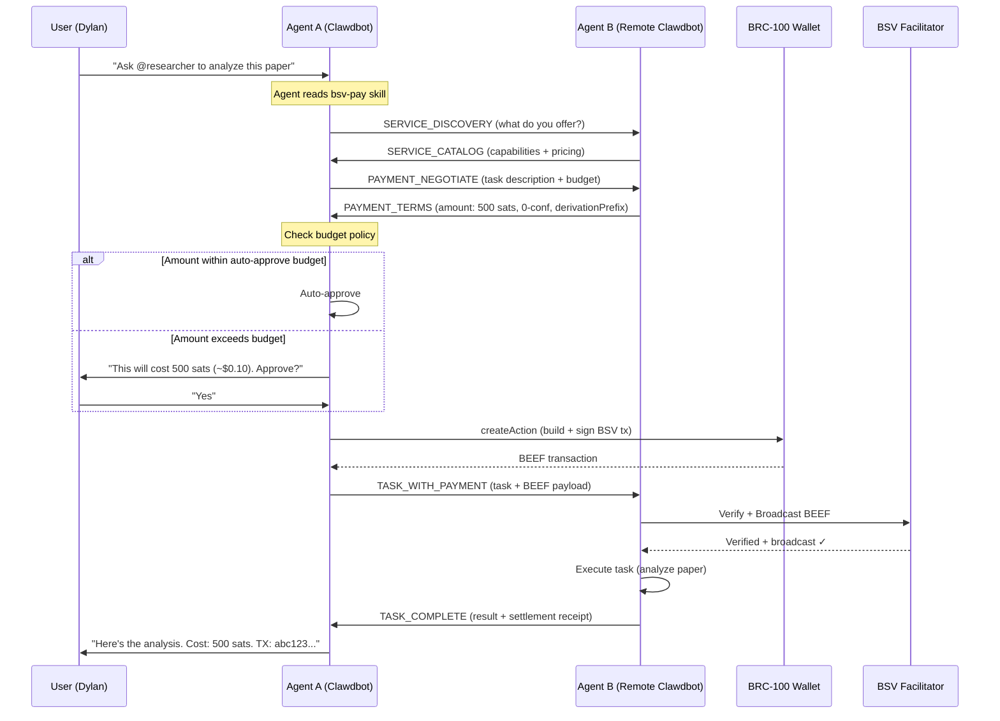

# Clawdbot-to-Clawdbot BSV Payments

## How Clawdbot Instances Can Pay Each Other Using the BSV A2A Payment Protocol

| Field | Value |
|---|---|
| **Version** | 1.0.0 |
| **Date** | 2026-01-30 |
| **Status** | Draft |
| **Parent Spec** | [PRD.md](PRD.md) — BSV Integration for AP2 via x402 |

---

## Table of Contents

1. [Executive Summary](#1-executive-summary)
2. [Clawdbot Architecture Context](#2-clawdbot-architecture-context)
3. [Design Goals](#3-design-goals)
4. [System Architecture](#4-system-architecture)
   - 4.1 [Component Overview](#41-component-overview)
   - 4.2 [BSV Wallet Skill](#42-bsv-wallet-skill)
   - 4.3 [Payment Negotiation Protocol](#43-payment-negotiation-protocol)
   - 4.4 [Service Discovery & Pricing](#44-service-discovery--pricing)
   - 4.5 [Payment Flow Between Clawdbots](#45-payment-flow-between-clawdbots)
5. [Skill Architecture](#5-skill-architecture)
   - 5.1 [bsv-wallet Skill](#51-bsv-wallet-skill)
   - 5.2 [bsv-pay Skill](#52-bsv-pay-skill)
   - 5.3 [bsv-merchant Skill](#53-bsv-merchant-skill)
   - 5.4 [bsv-facilitator Skill](#54-bsv-facilitator-skill)
6. [MCP Tool Definitions](#6-mcp-tool-definitions)
7. [Inter-Agent Communication](#7-inter-agent-communication)
   - 7.1 [Same-Gateway (Local Agents)](#71-same-gateway-local-agents)
   - 7.2 [Cross-Gateway (Remote Agents)](#72-cross-gateway-remote-agents)
   - 7.3 [Payment Channel Messages](#73-payment-channel-messages)
8. [Configuration & Setup](#8-configuration--setup)
9. [User Experience Flows](#9-user-experience-flows)
10. [Security Model](#10-security-model)
11. [Implementation Roadmap](#11-implementation-roadmap)
12. [Example Scenarios](#12-example-scenarios)

---

## 1. Executive Summary

This document describes how the BSV payment protocol defined in [PRD.md](PRD.md) can be built, packaged, and distributed so that **any Clawdbot instance can pay any other Clawdbot instance** for services — research, code generation, data analysis, image processing, or any task an agent can perform.

The integration is built as a set of **Clawdbot skills** (installable packages that add capabilities to any Clawdbot agent) and **MCP tools** (standardized tool interfaces agents call during conversations). A user says "use @researcher-bot to analyze this paper" and their Clawdbot:

1. Discovers the remote agent and its pricing
2. Negotiates payment terms (BSV amount, confirmation requirements)
3. Constructs and signs a BSV transaction via the BRC-100 wallet
4. Sends the payment + task to the remote agent
5. Receives the completed work + on-chain receipt

All of this happens through standard Clawdbot primitives — skills, sessions, MCP tools, and cross-gateway messaging — with BSV as the settlement layer.

### Why This Matters

Today, Clawdbot agents can talk to each other (via `sessions_send` locally, or cross-gateway messaging remotely), but there's no way for Agent A to **pay** Agent B for a service. This means:

- Agents can't monetize their specialized capabilities
- There's no economic incentive to build and host high-quality specialist agents
- Multi-agent workflows can't include paid services from third parties

BSV micropayments fix this. At ~$0.00005 per transaction fee, an agent can pay another agent 1 satoshi ($0.0002) for a quick lookup, or 50,000 satoshis ($10) for a complex research task, with the same protocol and negligible overhead either way.

---

## 2. Clawdbot Architecture Context

Understanding how this fits into Clawdbot's existing architecture:

### Key Primitives We Build On

| Clawdbot Primitive | How We Use It |
|---|---|
| **Skills** | Installable packages that add BSV payment capabilities to any agent. A skill provides a `SKILL.md` (instructions the agent reads), scripts, and tool definitions. Distributed via ClawdHub or git repos. |
| **MCP Tools** | Standardized tool interfaces. We define BSV-specific tools (`bsv_pay`, `bsv_receive`, `bsv_balance`, etc.) that agents can call during conversations. |
| **Sessions** | Each payment negotiation happens in a session. Local agents use `sessions_send`; cross-gateway agents use channel routing. |
| **Sub-agents** (`sessions_spawn`) | Heavy payment tasks (UTXO management, batch settlements) can run as sub-agents without blocking the main conversation. |
| **Multi-agent routing** | Different agents on the same gateway can have different BSV wallets and pricing. Bindings route payment messages to the right agent. |
| **Gateway WebSocket** | The gateway mediates all agent communication. Payment protocol messages travel through the existing message infrastructure. |
| **Nodes** | Mobile/desktop nodes could serve as hardware wallet approval devices for high-value payments. |
| **Cron** | Scheduled tasks for UTXO consolidation, balance monitoring, payment reconciliation. |
| **Hooks** | Webhook endpoints for receiving payment notifications from the BSV Facilitator. |

### What We Don't Change

- No modifications to the Clawdbot Gateway core
- No new transport protocols — payments ride on existing session/message infrastructure
- No changes to the agent loop — the agent reads skills, calls tools, same as any other task
- No mandatory dependency — agents without the BSV skill simply can't participate in paid exchanges

---

## 3. Design Goals

| # | Goal | Rationale |
|---|---|---|
| D1 | **Install-and-go** | `clawdbot skills add bsv-wallet` should be all a user needs to start. No devops, no server setup for basic use. |
| D2 | **Skill-based distribution** | All BSV payment capabilities ship as Clawdbot skills installable from ClawdHub or git. |
| D3 | **MCP-native tools** | Payment operations are MCP tools the agent can call naturally in conversation. |
| D4 | **Works locally and remotely** | Same-gateway agents use `sessions_send`; cross-gateway agents use Telegram/Signal/WebChat or direct WebSocket. |
| D5 | **User stays in control** | High-value payments require user approval. Micropayments can be auto-approved within configured budgets. |
| D6 | **Progressive complexity** | Basic: pay another agent. Advanced: run a merchant agent that sells services. Expert: run your own facilitator. |
| D7 | **On-chain receipts** | Every payment produces a verifiable BSV transaction that both parties can audit. |
| D8 | **Privacy by default** | BRC-42 key derivation ensures payments are unlinkable without explicit key revelation. |

---

## 4. System Architecture

### 4.1 Component Overview

```
┌─────────────────────────────────────────────────────────────────────┐
│                        Clawdbot Gateway A                          │
│                                                                     │
│  ┌──────────────┐     ┌──────────────┐     ┌─────────────────────┐ │
│  │   Agent A     │     │  BSV Wallet   │     │   BSV Pay Skill    │ │
│  │  (main agent) │────▶│   Skill       │────▶│  (client tools)    │ │
│  │              │     │              │     │                     │ │
│  │  AGENTS.md   │     │ • BRC-100    │     │ • bsv_pay          │ │
│  │  SOUL.md     │     │   wallet     │     │ • bsv_negotiate    │ │
│  │  skills/     │     │ • Key mgmt   │     │ • bsv_balance      │ │
│  └──────────────┘     │ • UTXO pool  │     │ • bsv_history      │ │
│                        └──────────────┘     └─────────────────────┘ │
│                              │                                       │
│                              ▼                                       │
│                   ┌──────────────────┐                               │
│                   │  Local BRC-100   │                               │
│                   │  Wallet Process  │                               │
│                   │  (babbage-sdk    │                               │
│                   │   or equivalent) │                               │
│                   └──────────────────┘                               │
└─────────────────────────────────────────────────────────────────────┘
           │                                          ▲
           │  Payment (BEEF tx via session message)   │
           ▼                                          │
┌─────────────────────────────────────────────────────────────────────┐
│                        Clawdbot Gateway B                          │
│                                                                     │
│  ┌──────────────┐     ┌──────────────┐     ┌─────────────────────┐ │
│  │   Agent B     │     │  BSV Wallet   │     │  BSV Merchant Skill│ │
│  │ (specialist)  │────▶│   Skill       │────▶│  (merchant tools)  │ │
│  │              │     │              │     │                     │ │
│  │  Pricing:    │     │ • BRC-100    │     │ • bsv_receive       │ │
│  │  50 sat/task │     │   wallet     │     │ • bsv_verify        │ │
│  │              │     │ • Key mgmt   │     │ • bsv_price_service │ │
│  └──────────────┘     │ • SPV verify │     │ • bsv_settle        │ │
│                        └──────────────┘     └─────────────────────┘ │
└─────────────────────────────────────────────────────────────────────┘
           │
           ▼
┌──────────────────┐         ┌──────────────────┐
│  BSV Facilitator │────────▶│   BSV Network    │
│  (shared hosted  │         │   (mainnet)      │
│   or self-hosted)│◀────────│                  │
└──────────────────┘         └──────────────────┘
```

### 4.2 BSV Wallet Skill

The **foundational skill** that every participating agent needs. It wraps a BRC-100 wallet implementation and exposes it to the agent as MCP tools.

**Installation:**
```bash
# From ClawdHub (future)
clawdbot skills add bsv-wallet

# From git (now)
clawdbot skills add --git https://github.com/galt-tr/a2a-bsv --path skills/bsv-wallet
```

**What it provides:**
- BRC-100 wallet process management (start, stop, health check)
- Key generation and backup (BRC-42 master key)
- Balance checking and UTXO management
- Transaction construction (`createAction`)
- Transaction signing (`signAction`)
- Payment receipt processing (`internalizeAction`)
- Identity key management (`getPublicKey`)

**Wallet storage:**
```
~/.clawdbot/agents/<agentId>/bsv/
├── wallet.key           # Encrypted master key (BRC-42)
├── utxo-cache.db        # SQLite UTXO cache
├── certificates/        # BRC-52 identity certificates
└── config.json          # Network, facilitator URL, budget limits
```

### 4.3 Payment Negotiation Protocol

When Agent A wants to pay Agent B for a service, they follow a structured negotiation:



### 4.4 Service Discovery & Pricing

Agents advertise their paid services through a **service manifest** in their workspace:

```yaml
# ~/clawd/BSV_SERVICES.yaml (in the merchant agent's workspace)
version: 1
identity_key: "02abc123..."  # Agent's BSV identity public key
services:
  - id: "research-paper"
    name: "Academic Paper Analysis"
    description: "Deep analysis of academic papers with citations and critique"
    pricing:
      model: "per-task"
      amount_satoshis: 500
      currency_note: "~$0.10 at current rates"
    requirements:
      min_confirmations: 0
      spv_required: true
      sender_identity_required: true
    
  - id: "code-review"
    name: "Code Review"
    description: "Security-focused code review with vulnerability assessment"
    pricing:
      model: "per-token"
      rate_satoshis_per_1k_tokens: 10
      max_amount_satoshis: 5000
    requirements:
      min_confirmations: 0
      spv_required: true

  - id: "image-gen"
    name: "Image Generation"
    description: "Generate images from text descriptions"
    pricing:
      model: "per-task"
      amount_satoshis: 1000
    requirements:
      min_confirmations: 1  # Higher value, want confirmation
```

**Discovery mechanisms (progressive):**

| Phase | Discovery Method | How It Works |
|---|---|---|
| **Phase 1** | Direct addressing | User provides the target agent's session key or channel address. "Pay @researcher on Telegram 500 sats to review this." |
| **Phase 2** | Gateway registry | Same-gateway agents discover each other via `sessions_list`. Service manifests are exchanged via `sessions_send`. |
| **Phase 3** | ClawdHub directory | Published service catalog on ClawdHub. Users search "code review agents" and get a list with pricing. |
| **Phase 4** | A2A protocol native | Full AP2 Agent Card with `bsv-p2pkh` payment requirements. Standard A2A discovery via `/.well-known/agent.json`. |

### 4.5 Payment Flow Between Clawdbots

#### Same-Gateway Flow (agents on the same Clawdbot instance)

```
Agent A                              Agent B
   │                                    │
   │  sessions_send(agentB_key,         │
   │    PAYMENT_NEGOTIATE message)      │
   │───────────────────────────────────▶│
   │                                    │
   │  sessions_send reply:              │
   │    PAYMENT_TERMS                   │
   │◀───────────────────────────────────│
   │                                    │
   │  [Wallet: createAction → BEEF]     │
   │                                    │
   │  sessions_send(agentB_key,         │
   │    TASK_WITH_PAYMENT + BEEF)       │
   │───────────────────────────────────▶│
   │                                    │──▶ Facilitator: verify + broadcast
   │                                    │◀── Confirmed ✓
   │                                    │
   │                                    │──▶ Execute task
   │                                    │
   │  sessions_send reply:              │
   │    TASK_COMPLETE + receipt          │
   │◀───────────────────────────────────│
```

This uses Clawdbot's existing `sessions_send` with its built-in ping-pong turns — the payment negotiation maps naturally to the request/reply/reply-back loop (max turns configurable via `session.agentToAgent.maxPingPongTurns`).

#### Cross-Gateway Flow (agents on different Clawdbot servers)

```
Gateway A                                         Gateway B
    │                                                  │
    │  Channel message (Telegram/Signal/WebChat):      │
    │  Structured payment negotiation message           │
    │─────────────────────────────────────────────────▶│
    │                                                  │
    │  Channel reply:                                  │
    │  Payment terms                                   │
    │◀─────────────────────────────────────────────────│
    │                                                  │
    │  Channel message:                                │
    │  Task + BEEF payment payload (base64 in message) │
    │─────────────────────────────────────────────────▶│
    │                                                  │──▶ Facilitator
    │                                                  │
    │  Channel reply:                                  │
    │  Task result + settlement receipt                │
    │◀─────────────────────────────────────────────────│
```

Cross-gateway payments use **existing channel infrastructure** (Telegram, Signal, etc.) to carry payment protocol messages. The structured message format is embedded in natural language so it works over any text channel:

```
[BSV-PAY-v1]
action: TASK_WITH_PAYMENT
task: "Analyze the attached paper for methodology flaws"
payment:
  scheme: bsv-p2pkh
  beef: AQC+7wAA... (base64)
  txid: a1b2c3d4...
  amount_satoshis: 500
  sender_identity: 03f1e2d3...
[/BSV-PAY-v1]
```

The receiving agent's BSV skill parses these structured blocks and handles them programmatically.

---

## 5. Skill Architecture

### 5.1 bsv-wallet Skill

**Purpose:** Core wallet management. Required by all other BSV skills.

```
skills/bsv-wallet/
├── SKILL.md              # Agent instructions for wallet operations
├── scripts/
│   ├── setup.sh          # First-run: generate keys, configure wallet
│   ├── wallet-server.js  # BRC-100 wallet process (long-running)
│   ├── balance.sh        # Check wallet balance
│   └── utxo-manage.sh    # UTXO consolidation/splitting
├── tools/
│   └── tools.json        # MCP tool definitions
└── package.json
```

**SKILL.md excerpt:**
```markdown
# BSV Wallet Skill

Use when the user asks about BSV balance, payments, or when another skill
requires wallet operations.

## Tools
- `bsv_balance`: Check wallet balance (confirmed + unconfirmed satoshis)
- `bsv_address`: Get a fresh receive address
- `bsv_identity`: Get the agent's BSV identity public key
- `bsv_utxos`: List available UTXOs with amounts and confirmation status
- `bsv_send`: Send BSV to an address (requires user approval above budget)

## Budget Policy
The user configures an auto-approve budget in BSV_SERVICES.yaml:
- Payments below the threshold are auto-approved
- Payments above require explicit user confirmation
- Daily spending limits enforce caps even with auto-approve

## First Run
If the wallet is not initialized, run scripts/setup.sh to:
1. Generate a BRC-42 master key
2. Encrypt it with a user-provided passphrase
3. Create the wallet database
4. Configure the facilitator endpoint
```

### 5.2 bsv-pay Skill

**Purpose:** Client-side payment tools. Used when this agent needs to pay another agent.

```
skills/bsv-pay/
├── SKILL.md              # Agent instructions for making payments
├── scripts/
│   ├── negotiate.js      # Payment negotiation protocol handler
│   ├── construct-tx.js   # Build BEEF transaction via BRC-100
│   └── verify-receipt.js # Verify settlement receipt
├── tools/
│   └── tools.json        # MCP tool definitions
└── package.json
```

**MCP Tools:**
```json
{
  "tools": [
    {
      "name": "bsv_pay_agent",
      "description": "Pay another Clawdbot agent for a service. Handles negotiation, payment construction, and receipt verification.",
      "parameters": {
        "target": "Session key, agent ID, or channel address of the agent to pay",
        "task": "Description of the task/service being requested",
        "max_budget_sats": "Maximum satoshis willing to pay (optional, uses default budget)",
        "require_receipt": "Whether to require on-chain settlement receipt (default: true)"
      }
    },
    {
      "name": "bsv_negotiate",
      "description": "Negotiate payment terms with a remote agent before committing.",
      "parameters": {
        "target": "Target agent identifier",
        "service_id": "Service ID from the agent's catalog (optional)",
        "task_description": "What you want done"
      }
    },
    {
      "name": "bsv_check_receipt",
      "description": "Verify an on-chain payment receipt.",
      "parameters": {
        "txid": "BSV transaction ID to verify",
        "expected_amount": "Expected satoshi amount",
        "expected_recipient": "Expected recipient identity key"
      }
    }
  ]
}
```

### 5.3 bsv-merchant Skill

**Purpose:** Server-side tools for agents that sell services. Handles receiving payments, verifying them, and managing pricing.

```
skills/bsv-merchant/
├── SKILL.md              # Agent instructions for receiving payments
├── scripts/
│   ├── verify-payment.js # SPV verification of incoming BEEF
│   ├── price-service.js  # Dynamic pricing logic
│   └── settle.js         # Broadcast + confirm via facilitator
├── tools/
│   └── tools.json        # MCP tool definitions
├── templates/
│   └── BSV_SERVICES.yaml # Template service catalog
└── package.json
```

**MCP Tools:**
```json
{
  "tools": [
    {
      "name": "bsv_receive_payment",
      "description": "Process an incoming BSV payment. Verifies SPV proof, broadcasts transaction, returns receipt.",
      "parameters": {
        "beef": "Base64-encoded BEEF transaction data",
        "expected_amount": "Expected satoshi amount",
        "sender_identity": "Sender's identity public key (optional)"
      }
    },
    {
      "name": "bsv_price_service",
      "description": "Calculate the price for a requested service based on the service catalog.",
      "parameters": {
        "service_id": "Service ID from BSV_SERVICES.yaml",
        "task_params": "Task-specific parameters that affect pricing (e.g., token count)"
      }
    },
    {
      "name": "bsv_generate_payment_terms",
      "description": "Generate payment requirements for a service request.",
      "parameters": {
        "service_id": "Service to price",
        "amount_satoshis": "Explicit amount (overrides catalog pricing)",
        "timeout_seconds": "Payment window (default: 30)"
      }
    }
  ]
}
```

### 5.4 bsv-facilitator Skill

**Purpose:** Optional skill for running a self-hosted BSV Facilitator. Most users will use a shared hosted facilitator; power users can run their own.

```
skills/bsv-facilitator/
├── SKILL.md              # Instructions for facilitator management
├── scripts/
│   ├── start.sh          # Start facilitator server (Docker or native)
│   ├── stop.sh           # Stop facilitator
│   ├── status.sh         # Health check
│   └── sync-headers.sh   # Force header sync
├── docker/
│   ├── Dockerfile
│   └── docker-compose.yml
└── package.json
```

This is a **Phase 2** deliverable — initially, a shared hosted facilitator at `facilitator.a2a-bsv.dev` serves all users.

---

## 6. MCP Tool Definitions

All BSV tools follow MCP conventions and are registered in the agent's tool manifest. Here's the complete tool surface:

### Core Wallet Tools (bsv-wallet skill)

| Tool | Description | Auth Level |
|---|---|---|
| `bsv_balance` | Current balance (confirmed + unconfirmed sats) | None |
| `bsv_identity` | Agent's BSV identity public key | None |
| `bsv_address` | Generate fresh receive address (BRC-42 derived) | None |
| `bsv_utxos` | List UTXOs with amounts, confirmations, baskets | None |
| `bsv_send` | Send BSV to address/key (budget policy enforced) | Budget/User |
| `bsv_history` | Transaction history with filtering | None |

### Payment Tools (bsv-pay skill)

| Tool | Description | Auth Level |
|---|---|---|
| `bsv_pay_agent` | End-to-end: negotiate + pay + receive result | Budget/User |
| `bsv_negotiate` | Negotiate payment terms before committing | None |
| `bsv_check_receipt` | Verify on-chain settlement receipt | None |
| `bsv_estimate_fee` | Estimate fee for a payment of given size | None |

### Merchant Tools (bsv-merchant skill)

| Tool | Description | Auth Level |
|---|---|---|
| `bsv_receive_payment` | Verify + broadcast incoming BEEF payment | None |
| `bsv_price_service` | Calculate price for a service request | None |
| `bsv_generate_payment_terms` | Generate BSVPaymentRequirements | None |
| `bsv_settle` | Combined verify + broadcast via facilitator | None |
| `bsv_revenue_report` | Revenue summary by service, time period | None |

### Authorization Model

```yaml
# In agent's BSV config (~/.clawdbot/agents/<agentId>/bsv/config.json)
budget:
  auto_approve_limit_sats: 1000        # Auto-approve payments ≤ 1000 sats
  daily_limit_sats: 50000              # Hard daily cap
  require_user_approval_above: 1000    # User must confirm above this
  
permissions:
  allow_auto_pay: true                 # Agent can pay without asking
  allow_merchant: true                 # Agent can receive payments
  allow_0conf: true                    # Accept 0-conf for micropayments
```

---

## 7. Inter-Agent Communication

### 7.1 Same-Gateway (Local Agents)

When Agent A and Agent B are on the **same Clawdbot gateway** (multi-agent config), payments use `sessions_send` directly:

```typescript
// Agent A calls bsv_pay_agent tool
// Under the hood, the skill uses sessions_send:

// Step 1: Discover Agent B's services
const discovery = await sessions_send({
  sessionKey: "agent:researcher:main",
  message: JSON.stringify({
    protocol: "bsv-pay-v1",
    action: "SERVICE_DISCOVERY"
  }),
  timeoutSeconds: 10
});

// Step 2: Negotiate payment
const terms = await sessions_send({
  sessionKey: "agent:researcher:main",
  message: JSON.stringify({
    protocol: "bsv-pay-v1",
    action: "PAYMENT_NEGOTIATE",
    task: "Analyze this paper for methodology flaws",
    service_id: "research-paper",
    max_budget_sats: 1000,
    sender_identity: "03f1e2d3..."
  }),
  timeoutSeconds: 10
});

// Step 3: Construct + send payment with task
const beef = await wallet.createAction({ /* ... */ });
const result = await sessions_send({
  sessionKey: "agent:researcher:main",
  message: JSON.stringify({
    protocol: "bsv-pay-v1",
    action: "TASK_WITH_PAYMENT",
    task: "Analyze this paper for methodology flaws",
    payment: {
      scheme: "bsv-p2pkh",
      beef: beef.toBase64(),
      txid: beef.txid,
      amount_satoshis: 500,
      sender_identity: "03f1e2d3...",
      derivation_suffix: "abc123"
    }
  }),
  timeoutSeconds: 120  // Give time for task execution
});
```

**Multi-agent config for payment-enabled agents:**

```json5
{
  agents: {
    list: [
      {
        id: "personal",
        workspace: "~/clawd",
        default: true
        // Has bsv-wallet + bsv-pay skills → can pay others
      },
      {
        id: "researcher",
        workspace: "~/clawd-researcher",
        model: "anthropic/claude-opus-4-5"
        // Has bsv-wallet + bsv-merchant skills → sells research services
      }
    ]
  },
  // Enable agent-to-agent messaging for payment flows
  tools: {
    agentToAgent: {
      enabled: true,
      allow: ["personal", "researcher"]
    }
  }
}
```

### 7.2 Cross-Gateway (Remote Agents)

When agents are on **different Clawdbot gateways** (different servers/users), payments route through a messaging channel. The protocol messages are structured blocks embedded in channel messages:

**Option A: Telegram/Signal/WhatsApp (existing channels)**

The client agent sends a structured message to the remote agent's channel address:

```python
# Agent A's skill sends via the message tool:
message.send(
    channel="telegram",
    target="@researcher_bot",  # Remote agent's Telegram handle
    message="""I'd like to use your paper analysis service.

[BSV-PAY-v1:NEGOTIATE]
service_id: research-paper
task: "Analyze attached paper for methodology flaws"  
max_budget_sats: 1000
sender_identity: 03f1e2d3c4b5a6...
reply_channel: telegram
reply_target: @dylan_bot
[/BSV-PAY-v1]"""
)
```

The remote agent's BSV skill recognizes the `[BSV-PAY-v1:...]` blocks and handles them programmatically, replying with structured payment terms.

**Option B: Direct WebSocket (Tailscale/VPN)**

For agents that can reach each other's gateways directly (same Tailscale network, VPN, etc.), a more efficient path:

```
Gateway A ──WebSocket──▶ Gateway B
  (client sends payment protocol messages directly)
```

This requires both gateways to be network-accessible to each other and paired, but avoids the overhead of routing through a messaging platform.

**Option C: A2A Protocol Native (Phase 4)**

The long-term vision: Clawdbot implements the A2A protocol natively, and payment messages use the standard x402 extension with the `bsv-p2pkh` scheme:

```
Agent A ──A2A tasks/send──▶ Agent B
  (standard x402 PaymentRequirements / PaymentPayload in metadata)
```

### 7.3 Payment Channel Messages

All payment protocol messages use a versioned envelope format:

```typescript
interface BSVPayMessage {
  protocol: "bsv-pay-v1";
  action: BSVPayAction;
  // Action-specific fields
  [key: string]: any;
}

type BSVPayAction =
  | "SERVICE_DISCOVERY"      // Request: what services do you offer?
  | "SERVICE_CATALOG"        // Response: here are my services + pricing
  | "PAYMENT_NEGOTIATE"      // Request: I want this service, here's my budget
  | "PAYMENT_TERMS"          // Response: here are the payment requirements
  | "PAYMENT_REJECTED"       // Either side: deal rejected (with reason)
  | "TASK_WITH_PAYMENT"      // Request: here's the task + signed BEEF payment
  | "PAYMENT_VERIFIED"       // Response: payment verified, working on task
  | "TASK_COMPLETE"          // Response: task done, here's the result + receipt
  | "TASK_FAILED"            // Response: task failed, here's why (refund?)
  | "RECEIPT"                // Settlement receipt with txid
  | "DISPUTE";               // Dispute initiation (future)
```

---

## 8. Configuration & Setup

### For Users (Pay Other Agents)

**Step 1: Install the wallet skill**
```bash
clawdbot skills add bsv-wallet
clawdbot skills add bsv-pay
```

**Step 2: Initialize wallet**
```
You: "Set up my BSV wallet"
Agent: "I'll create a new BSV wallet. Please provide a passphrase to encrypt your keys."
You: "hunter2"
Agent: "Wallet created. Your identity key is 03f1e2d3...
       Fund your wallet by sending BSV to: 1A2b3C4d...
       Current balance: 0 sats"
```

**Step 3: Configure budget**
```
You: "Set my BSV auto-approve limit to 1000 sats and daily max to 50000 sats"
Agent: "Updated BSV budget:
       • Auto-approve: ≤ 1000 sats per payment
       • Daily limit: 50,000 sats
       • User approval required above 1000 sats"
```

**Step 4: Pay an agent**
```
You: "Ask @researcher to analyze this paper. Budget up to 500 sats."
Agent: [negotiates with researcher agent]
       "Researcher offers paper analysis for 500 sats (~$0.10). Proceeding...
        Payment sent: TX abc123... (500 sats)
        
        [Research results here]
        
        Receipt: 500 sats paid, confirmed in block 890,124"
```

### For Merchants (Sell Services)

**Step 1: Install skills**
```bash
clawdbot skills add bsv-wallet
clawdbot skills add bsv-merchant
```

**Step 2: Define services**

Create `BSV_SERVICES.yaml` in the agent's workspace (the skill provides a template).

**Step 3: Advertise**

The agent automatically responds to `SERVICE_DISCOVERY` messages with its catalog. For cross-gateway discovery, register on ClawdHub (Phase 3).

### Configuration Reference

```json5
// ~/.clawdbot/agents/<agentId>/bsv/config.json
{
  // Network
  "network": "bsv-mainnet",       // or "bsv-testnet"
  "facilitator": "https://facilitator.a2a-bsv.dev",
  
  // Wallet
  "wallet": {
    "keyFile": "wallet.key",       // Relative to bsv/ dir
    "utxoDB": "utxo-cache.db",
    "autoConsolidate": true,       // Merge small UTXOs periodically
    "consolidateThreshold": 100    // Merge when >100 UTXOs
  },
  
  // Budget (for paying agents)
  "budget": {
    "autoApproveLimitSats": 1000,
    "dailyLimitSats": 50000,
    "requireApprovalAbove": 1000,
    "allowAutoPay": true
  },
  
  // Merchant (for receiving payments)
  "merchant": {
    "enabled": false,              // Set true to accept payments
    "servicesFile": "BSV_SERVICES.yaml",
    "minConfirmations": 0,
    "spvRequired": true,
    "autoSettle": true             // Auto-broadcast received payments
  },
  
  // Privacy
  "privacy": {
    "deriveNewAddressPerPayment": true,  // BRC-42 derived keys
    "includeIdentityInPayments": true,   // BRC-29 authenticated
    "allowKeyLinkageRevelation": false   // BRC-69 audit
  }
}
```

---

## 9. User Experience Flows

### Flow 1: Simple Payment (User-Initiated)

```
User: "Pay @coder 200 sats to review my PR"

Agent (reads bsv-pay skill):
  1. Check balance: 45,000 sats ✓
  2. 200 sats < auto-approve limit (1000) → proceed
  3. Send PAYMENT_NEGOTIATE to @coder
  4. Receive PAYMENT_TERMS: 200 sats, 0-conf
  5. createAction → BEEF transaction
  6. Send TASK_WITH_PAYMENT
  7. Wait for TASK_COMPLETE

Agent: "Code review complete. @coder found 2 issues:
       1. SQL injection in line 42
       2. Missing null check in auth handler
       
       Payment: 200 sats (TX: abc123...) ✓"
```

### Flow 2: Budget Exceeded (Approval Required)

```
User: "Get @analyst to do a full market analysis on BSV"

Agent:
  1. Send PAYMENT_NEGOTIATE to @analyst
  2. Receive PAYMENT_TERMS: 5000 sats
  3. 5000 sats > auto-approve limit (1000) → ask user

Agent: "Market analysis from @analyst costs 5,000 sats (~$1.00).
       Your daily remaining budget: 45,000 sats.
       Approve this payment?"

User: "Yes"

Agent:
  4. createAction → BEEF transaction
  5. Send TASK_WITH_PAYMENT
  6. Wait for TASK_COMPLETE
  
Agent: "Analysis complete. [results...]
       Payment: 5,000 sats (TX: def456...) ✓"
```

### Flow 3: Merchant Agent (Automatic)

On the merchant side, everything is automatic:

```
Incoming message from Agent A:
  [BSV-PAY-v1:TASK_WITH_PAYMENT]
  task: "Review this code for security issues"
  payment: { beef: "...", amount: 200, ... }

Merchant Agent (reads bsv-merchant skill):
  1. Parse payment protocol message
  2. Verify BEEF via facilitator → valid ✓
  3. Broadcast transaction → accepted ✓
  4. Execute the requested task (code review)
  5. Compose result
  6. Send TASK_COMPLETE with settlement receipt

Agent: (sends reply to Agent A with results + receipt)
```

### Flow 4: Discovery (Finding Agents to Pay)

```
User: "Find me an agent that can generate images. Budget: 2000 sats."

Agent:
  1. Check local agents (sessions_list) for bsv-merchant skills
  2. Query ClawdHub directory for "image generation" services
  3. Compare pricing across available agents

Agent: "Found 3 agents offering image generation:
       1. @artbot - 500 sats/image (4.8★, 1.2k jobs)
       2. @picgen - 300 sats/image (4.5★, 800 jobs)  
       3. @dalle-agent - 1000 sats/image (4.9★, 3k jobs)
       
       Which one should I use?"

User: "Use @artbot"

Agent: [proceeds with payment flow]
```

---

## 10. Security Model

### Threat Model

| Threat | Mitigation |
|---|---|
| **Agent overspending** | Budget policy: auto-approve limits, daily caps, user approval for large amounts |
| **Malicious merchant (takes payment, no service)** | On-chain receipt proves payment. Dispute protocol (Phase 5). Reputation system on ClawdHub. |
| **Payment interception** | BEEF transactions are signed — intercepting doesn't help without private keys. BRC-42 derived addresses are unique per payment. |
| **Fake service catalog** | BRC-52 identity certificates verify merchant identity. ClawdHub verified listings. |
| **Double-spend attack** | SPV verification + facilitator broadcast. For micropayments, cost of attack >> value. Rate limiting per identity key. |
| **Key theft** | Encrypted key storage. Node devices (iOS/Android) for hardware-backed approval of high-value payments. |
| **Privacy leakage** | BRC-42 key derivation: each payment uses a unique derived address. No address reuse. BRC-69 revelation only with explicit consent. |

### User Approval Gates

```
Payment Amount           Required Approval
─────────────────────────────────────────
≤ auto_approve_limit     Automatic (agent decides)
> auto_approve_limit     User must confirm
> daily_limit            Blocked (hard cap)
```

### Node-Based Hardware Approval (Future)

For high-value payments, a Clawdbot node (iOS/Android app) can serve as a hardware approval device:

```
Agent: "Payment of 50,000 sats (~$10) to @analyst requires approval."
  → Push notification to user's phone (Clawdbot node)
  → User approves on phone (biometric + tap)
  → Node sends signed approval back to gateway
  → Payment proceeds
```

This uses the existing Clawdbot node pairing and notification infrastructure.

---

## 11. Implementation Roadmap

### Phase 1: Core Skills (Weeks 1–6)

- [ ] **bsv-wallet skill**
  - [ ] BRC-100 wallet wrapper (TypeScript)
  - [ ] Key generation and encrypted storage
  - [ ] Balance/UTXO management tools
  - [ ] SKILL.md with agent instructions
  - [ ] MCP tool definitions
  - [ ] Setup script (first-run experience)

- [ ] **bsv-pay skill**
  - [ ] Payment negotiation protocol handler
  - [ ] BEEF transaction construction via wallet
  - [ ] Receipt verification
  - [ ] Budget policy enforcement
  - [ ] User approval prompts

- [ ] **bsv-merchant skill**
  - [ ] Service catalog (BSV_SERVICES.yaml)
  - [ ] Incoming payment verification (SPV)
  - [ ] Settlement via facilitator
  - [ ] Revenue tracking

### Phase 2: Local Agent Payments (Weeks 5–10)

- [ ] Same-gateway payment flows via `sessions_send`
  - [ ] Multi-agent config examples
  - [ ] Payment protocol message parsing
  - [ ] End-to-end test: Agent A pays Agent B on same gateway
- [ ] Hosted BSV Facilitator service
  - [ ] Deploy at `facilitator.a2a-bsv.dev`
  - [ ] SPV verification engine
  - [ ] Transaction broadcast
  - [ ] Health monitoring

### Phase 3: Cross-Gateway Payments (Weeks 8–14)

- [ ] Channel-based payment messaging (Telegram, Signal, etc.)
  - [ ] `[BSV-PAY-v1]` structured message format
  - [ ] Parser for incoming payment protocol messages
  - [ ] Reply routing for payment flows
- [ ] ClawdHub service directory
  - [ ] Publish service catalogs
  - [ ] Search and discovery API
  - [ ] Reputation/rating system (basic)

### Phase 4: A2A Protocol Integration (Weeks 12–18)

- [ ] Full AP2/x402 `bsv-p2pkh` scheme support
  - [ ] Agent Card with payment requirements
  - [ ] Standard x402 message flow (metadata-based)
  - [ ] Interop with non-Clawdbot A2A agents
- [ ] MCP server for BSV payments
  - [ ] `bsv-pay` MCP server (any MCP client can use)
  - [ ] Publish to MCP Registry

### Phase 5: Advanced Features (Weeks 16–24)

- [ ] Node-based payment approval (iOS/Android push notifications)
- [ ] Dispute resolution protocol
- [ ] Streaming payments (pay-per-token as service executes)
- [ ] Multi-party payments (Agent A pays Agents B, C, D in one flow)
- [ ] Payment channels for high-frequency agent pairs
- [ ] Self-hosted facilitator skill (Docker-based)
- [ ] Escrow for high-value tasks (payment held until task verified)

---

## 12. Example Scenarios

### Scenario 1: Research Assistant Pays a Specialist

Dylan asks his personal Clawdbot (Agent A) to get a deep code review from a specialist agent (Agent B) hosted by a developer community.

- Agent A has `bsv-wallet` + `bsv-pay` skills
- Agent B has `bsv-wallet` + `bsv-merchant` skills with a `code-review` service at 1000 sats
- Agent B is on a different Clawdbot gateway, reachable via Telegram

```
Dylan: "Get @secbot on Telegram to do a security audit of our auth module. 
        Here's the code: [paste]"

Agent A: [sends SERVICE_DISCOVERY to @secbot via Telegram]
         [receives: code-review service, 1000 sats]
         "Security audit from @secbot costs 1000 sats (~$0.20). Within your auto-approve budget. Proceeding..."
         
         [constructs BEEF payment: 1000 sats to Agent B's derived address]
         [sends TASK_WITH_PAYMENT via Telegram]
         [waits for Agent B to verify payment + complete audit]
         
         "Security audit complete:
          
          🔴 Critical: JWT secret is hardcoded (line 15)
          🟡 Warning: No rate limiting on login endpoint
          🟢 Good: CSRF tokens properly implemented
          
          Full report attached.
          Payment: 1,000 sats (TX: abc123...) ✓"
```

### Scenario 2: Agent Marketplace

A user's Clawdbot needs multiple specialist agents for a complex task:

```
Dylan: "Create a full brand kit for my new startup 'NovaPay'"

Agent A: [searches ClawdHub for brand-related services]
         "I'll coordinate three specialist agents:
          1. @brandbot: Name analysis + tagline (200 sats)
          2. @artbot: Logo generation (1000 sats)  
          3. @copybot: Brand voice + copy guidelines (500 sats)
          Total: 1,700 sats (~$0.34). Approve?"

Dylan: "Go for it"

Agent A: [spawns sub-agent for parallel coordination]
         [pays @brandbot 200 sats → receives name analysis]
         [pays @artbot 1000 sats → receives 3 logo concepts]
         [pays @copybot 500 sats → receives brand guidelines]
         [synthesizes results]
         
         "Brand kit for NovaPay is ready:
          📝 Tagline: 'Payments without borders'
          🎨 3 logo concepts attached
          ✍️ Brand voice: Professional but approachable
          
          Total spent: 1,700 sats across 3 agents.
          Receipts: TX abc123, def456, ghi789"
```

### Scenario 3: Pay-Per-Token Streaming (Phase 5)

For long-running tasks, streaming payments release sats as the merchant agent produces output:

```
Dylan: "Get @analyst to write a 5000-word market report on BSV. Pay per section."

Agent A: [negotiates streaming payment: 100 sats per 500 words]
         [pays 100 sats → receives executive summary]
         [pays 100 sats → receives market overview]
         [pays 100 sats → receives competitive analysis]
         ...continues until complete...
         
         "Report complete. 10 payments × 100 sats = 1,000 sats total.
          10 on-chain receipts for full audit trail."
```

---

## Appendix: Relationship to PRD.md

This document defines the **Clawdbot-specific integration layer**. The [PRD.md](PRD.md) defines the **underlying protocol** (x402 scheme, data structures, facilitator API). The relationship:

| Layer | Document | What It Defines |
|---|---|---|
| **Protocol** | PRD.md | `bsv-p2pkh` scheme, data structures, A2A message flows, facilitator API, SPV verification |
| **Integration** | This document | Clawdbot skills, MCP tools, inter-agent flows, user experience, configuration, distribution |

A non-Clawdbot A2A agent would implement the protocol from PRD.md directly. Clawdbot agents use the skills and tools defined here, which implement the protocol internally.

---

*This specification enables an economy of AI agents where specialized capabilities have real economic value, paid for in micropayments on the BSV blockchain. Any Clawdbot instance with the right skills can participate — as a buyer, seller, or both.*
