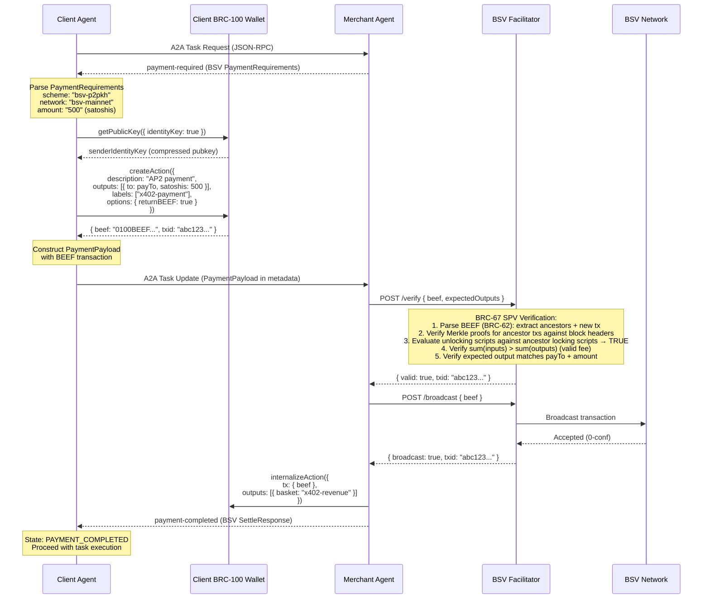
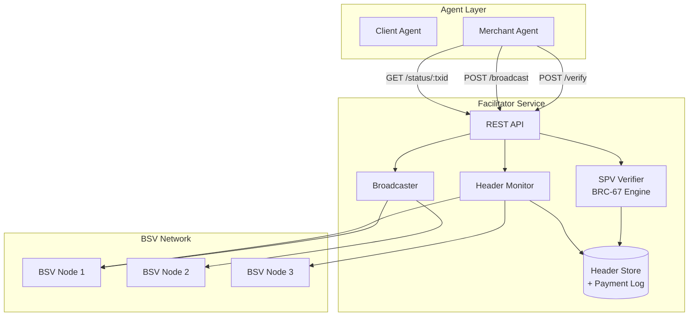
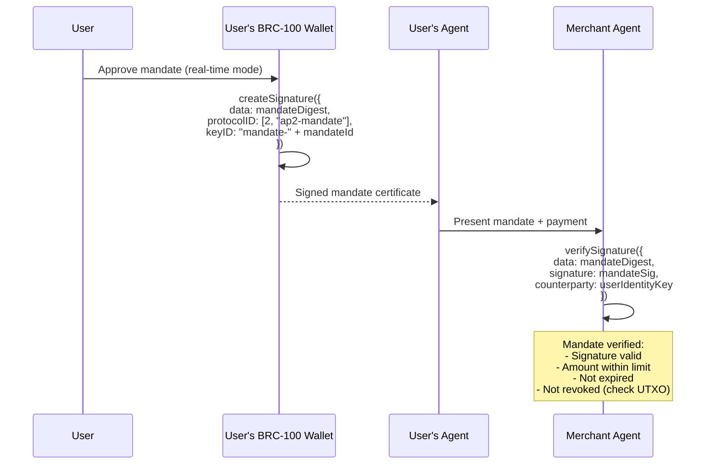
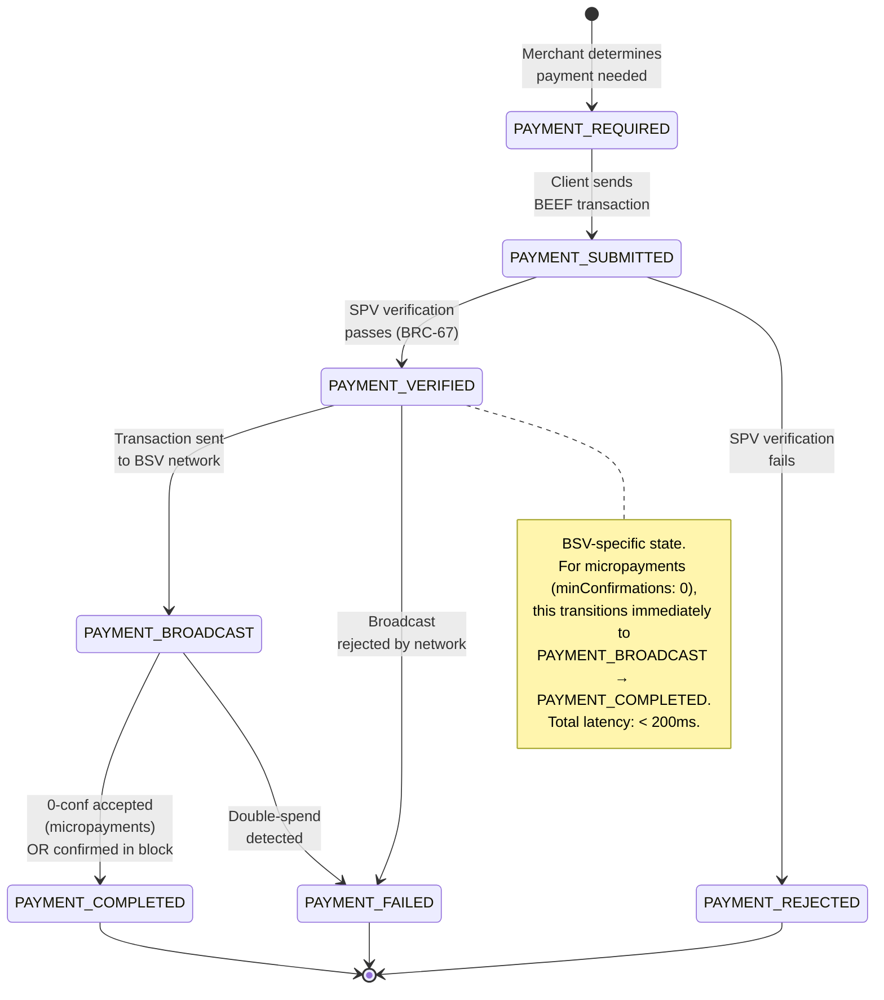

# BSV Integration for Google AP2 via x402

## Product Requirements Document & Technical Specification

| Field | Value |
|---|---|
| **Version** | 1.0.0 |
| **Date** | 2026-01-30 |
| **Status** | Draft |
| **Authors** | BSV Agent Payments Working Group |
| **Extension URI** | `https://github.com/google-a2a/a2a-x402/v0.1` |
| **Scheme Identifier** | `bsv-p2pkh` |

---

## Table of Contents

1. [Executive Summary](#1-executive-summary)
2. [Problem Statement](#2-problem-statement)
3. [Goals & Non-Goals](#3-goals--non-goals)
4. [Technical Architecture](#4-technical-architecture)
   - 4.1 [BSV Payment Scheme Definition](#41-bsv-payment-scheme-definition)
   - 4.2 [Payment Flow (BSV-specific)](#42-payment-flow-bsv-specific)
   - 4.3 [BRC-100 Wallet Integration](#43-brc-100-wallet-integration)
   - 4.4 [BSV Facilitator Service](#44-bsv-facilitator-service)
   - 4.5 [UTXO Management for Agents](#45-utxo-management-for-agents)
   - 4.6 [Identity & Mandates](#46-identity--mandates)
5. [Data Structures (Full Spec)](#5-data-structures-full-spec)
   - 5.1 [BSV PaymentRequirements](#51-bsv-paymentrequirements)
   - 5.2 [BSV PaymentPayload](#52-bsv-paymentpayload)
   - 5.3 [BSV SettleResponse](#53-bsv-settleresponse)
   - 5.4 [BSV-specific Metadata](#54-bsv-specific-metadata)
6. [Message Flow Specification](#6-message-flow-specification)
7. [Security Considerations](#7-security-considerations)
8. [Implementation Plan](#8-implementation-plan)
9. [Success Metrics](#9-success-metrics)
10. [Appendices](#10-appendices)
    - A: [TypeScript Interface Definitions](#appendix-a-complete-typescript-interface-definitions)
    - B: [BSV Scheme Spec for x402](#appendix-b-bsv-scheme-spec-for-x402-schemes-submission)
    - C: [Glossary](#appendix-c-glossary-of-bsvbrc-terms-mapped-to-ap2x402-terms)

---

## 1. Executive Summary

### What This Integration Achieves

This document specifies the integration of Bitcoin SV (BSV) as a first-class payment rail within Google's Agent Payments Protocol (AP2) through the x402 crypto-payment extension. The integration introduces a new payment scheme — `bsv-p2pkh` — that enables AI agents to conduct authenticated, on-chain micropayments using BSV's native Pay-to-Public-Key-Hash scripts, verified through Simplified Payment Verification (SPV), and managed through the BRC-100 wallet interface standard.

The result is a complete payment path — from intent through settlement — that costs fractions of a cent per transaction, settles in seconds, and scales to millions of concurrent agent-to-agent payments without requiring full-node infrastructure on either side.

### Why BSV Is Uniquely Suited for Agent-to-Agent Payments

The agent economy is structurally different from human commerce. Agents transact programmatically, at high frequency, often for sub-cent values — requesting an API call, purchasing a data feed, tipping for priority routing. These usage patterns expose fundamental mismatches with the current x402 implementation:

| Property | EVM (Current x402) | BSV (This Proposal) |
|---|---|---|
| **Median tx fee** | $0.01–$0.50+ (Base L2) | $0.00005–$0.0005 |
| **Throughput** | ~1,000 TPS (Base) | 50,000+ TPS (tested) |
| **Payment model** | Account-based (nonce serialization) | UTXO (fully parallelizable) |
| **Verification** | Full EVM execution or trusted RPC | SPV with Merkle proofs (BRC-67) |
| **Payload format** | EIP-712 typed signing | BEEF binary (BRC-62), ~500–2000 bytes |
| **Finality model** | Block confirmations | 0-conf (safe for micropayments) + SPV |
| **Smart contract overhead** | ERC-20 approve+transfer | Native P2PKH (single opcode script) |
| **Nonce management** | Required, serializes all txs | None — UTXOs are independent |

BSV's UTXO model means every payment is a discrete, self-contained token (BRC-45). An agent can construct, sign, and submit thousands of payments in parallel without waiting for nonce synchronization. SPV verification (BRC-67) allows the receiving agent to validate a payment using only a Merkle proof against block headers — no full node, no RPC dependency, no trust assumption beyond proof-of-work.

### Target Audience

- **Protocol implementers** building x402 payment schemes
- **Agent framework developers** integrating AP2 payments (A2A, MCP)
- **BSV wallet developers** implementing BRC-100 for agent contexts
- **Infrastructure operators** running BSV facilitator services
- **Google AP2 working group** evaluating new payment rails

---

## 2. Problem Statement

### 2.1 Current x402 Limitations

The x402 extension was designed as a payment-agnostic framework, but its initial — and currently only — implementation targets EVM chains (specifically Base network with ERC-20 tokens and EIP-712 signing). This creates three structural problems for the agent payment use case:

**Cost floor eliminates micropayments.** Even on Base (Ethereum L2), a typical ERC-20 transfer costs $0.01–$0.10. For an agent purchasing a single API inference at $0.001, the payment overhead exceeds the payment value by 10–100×. This makes the entire class of sub-cent agent transactions economically irrational.

**Nonce serialization creates bottlenecks.** EVM's account model requires sequential nonce management. An agent that needs to pay 50 different merchant agents concurrently must serialize all 50 transactions through a single nonce counter, or maintain multiple funded accounts. This is architecturally hostile to the parallel, high-frequency nature of agent commerce.

**Verification requires trusted infrastructure.** Verifying an EVM payment requires querying an Ethereum node (or trusting an RPC provider like Infura/Alchemy). There is no lightweight, cryptographic proof that a payment occurred — the merchant agent must either run a full node or trust a third party. This undermines the self-sovereign verification model that agent-to-agent commerce demands.

### 2.2 Agent Payment Demands

The emerging agent economy requires a payment rail with specific properties:

1. **Sub-cent viability**: Agents will routinely transact at $0.0001–$0.01 per interaction. The payment fee must be negligible relative to the payment value.
2. **Massive parallelism**: A single orchestrating agent may simultaneously pay dozens of specialist agents. Payments cannot be serialized.
3. **Lightweight verification**: Agents run in constrained environments (containers, edge devices, serverless functions). Payment verification must not require gigabytes of state or persistent connections to full nodes.
4. **Instant settlement for low values**: For micropayments, waiting for block confirmations is economically irrational. The risk of a $0.001 double-spend is negligible; the cost of waiting is not.
5. **Auditability**: Every payment must be cryptographically traceable to an authorized mandate, with a complete chain of proof from user authorization to on-chain settlement.
6. **Identity integration**: Agents act on behalf of humans. The payment system must integrate with identity frameworks that prove delegation authority.

### 2.3 Gap Analysis

| Requirement | Current x402 (EVM) | BSV via `bsv-p2pkh` |
|---|---|---|
| Sub-cent tx economically viable | ❌ Fee > payment value | ✅ Fee ~$0.00005 |
| Parallel payment construction | ❌ Nonce serialization | ✅ Independent UTXOs |
| Lightweight verification | ❌ Requires full/light node or RPC | ✅ SPV with BEEF (BRC-62/67) |
| Instant micropayment settlement | ⚠️ L2 blocks (~2s) but still requires confirmation | ✅ 0-conf safe for micropayments |
| On-chain audit trail | ⚠️ Possible but expensive | ✅ OP_RETURN data at negligible cost |
| Identity framework | ❌ Address-only | ✅ BRC-52 certificates + BRC-42 key derivation |
| Wallet standard for agents | ❌ MetaMask (human-oriented) | ✅ BRC-100 (programmatic ABI) |
| Binary-efficient payloads | ❌ JSON-heavy EIP-712 | ✅ BEEF binary format (~500–2000 bytes with proofs) |

---

## 3. Goals & Non-Goals

### Goals

| # | Goal | Success Criteria |
|---|---|---|
| G1 | Define a complete BSV payment scheme (`bsv-p2pkh`) for the x402 extension | Scheme spec passes x402 validation; all data structures defined with types |
| G2 | Integrate BRC-100 wallet interface as the signing/key-management layer | All x402 operations map to BRC-100 method calls with documented parameters |
| G3 | Implement SPV-based payment verification (BRC-67) for merchant agents | Merchant can verify payment with zero external RPC calls, using only BEEF data |
| G4 | Optimize for micropayments ($0.0001–$0.01 range) | Payment overhead (fee + verification time) < 5% of payment value at $0.001 |
| G5 | Map BRC-52 Identity Certificates to AP2 Mandates | Mandate signing and verification uses BSV-native cryptographic identity |
| G6 | Build a BSV Facilitator service for transaction broadcast and confirmation | REST API spec with <100ms verification latency |
| G7 | Provide reference implementations in TypeScript and Python | Working client + merchant agent demos with end-to-end payment flow |
| G8 | Submit upstream to x402 `schemes/` directory and AP2 working group | PR-ready scheme specification and supporting documentation |

### Non-Goals

| # | Non-Goal | Rationale |
|---|---|---|
| NG1 | Replace existing EVM payment schemes | x402 is multi-scheme by design; BSV is additive |
| NG2 | Build a new protocol from scratch | We extend x402's existing architecture, data structures, and state machine |
| NG3 | Support BSV token protocols (e.g., 1Sat Ordinals, Run) | Initial scope is native BSV (satoshis) only; token support is Phase 2+ |
| NG4 | Require BSV full-node infrastructure for agents | SPV verification via BEEF is the core value proposition |
| NG5 | Handle fiat on/off-ramps | Out of scope; handled by external services |
| NG6 | Modify the AP2 Mandate structure | We map to it, not modify it |

---

## 4. Technical Architecture

### 4.1 BSV Payment Scheme Definition

#### Scheme Identifier

```
scheme: "bsv-p2pkh"
```

This identifier is registered in the x402 `schemes/` directory and referenced in `PaymentRequirements.scheme`. The name encodes the payment script type (Pay-to-Public-Key-Hash), distinguishing it from future BSV schemes (e.g., `bsv-r-puzzle`, `bsv-hashlock`, `bsv-token`).

#### Conceptual Mapping: EVM → BSV

The x402 data structures were designed with EVM semantics. The following table defines how each field maps to BSV equivalents:

| x402 Field | EVM Meaning | BSV Meaning (`bsv-p2pkh`) |
|---|---|---|
| `scheme` | `"exact"` | `"bsv-p2pkh"` |
| `network` | `"base-sepolia"`, `"base"` | `"bsv-mainnet"`, `"bsv-testnet"` |
| `asset` | ERC-20 contract address | `"bsv"` (native satoshis) — no contract address |
| `payTo` | Ethereum address (0x...) | BSV identity key (hex-encoded compressed public key, 33 bytes) or P2PKH address |
| `maxAmountRequired` | Amount in wei (string) | Amount in **satoshis** (string) — 1 BSV = 100,000,000 satoshis |
| `resource` | URI of the resource being purchased | Same — URI of the resource being purchased |
| `description` | Human-readable description | Same |
| `maxTimeoutSeconds` | Max time for payment completion | Same |
| `extra` | Scheme-specific additional data | BSV-specific: `derivationPrefix`, `senderIdentityRequired`, `spvRequired` |

#### Key Design Decisions

1. **Identity keys over addresses**: BSV's BRC-29 payment protocol uses identity public keys (BRC-42) rather than raw addresses. The `payTo` field accepts either format, but identity keys enable authenticated payments with key derivation. When using BRC-29, both parties derive a unique payment address using the invoice number format `"2-3241645161d8-{derivationPrefix} {derivationSuffix}"` — the prefix is provided by the merchant in `PaymentRequirements.extra.derivationPrefix`, and the suffix is chosen by the client and included in `PaymentPayload.payload.derivationSuffix`.

2. **Satoshis as the unit**: All amounts are denominated in satoshis (integers as strings), not BSV (floating point). This avoids floating-point ambiguity. `"1000"` means 1,000 satoshis = 0.00001 BSV.

3. **BEEF as the payload format**: The signed payment is a complete BSV transaction in BEEF format (BRC-62), not an EIP-712 typed data signature. This is a self-contained, SPV-verifiable proof of payment.

4. **SPV verification replaces on-chain lookup**: The merchant does not need to query a node to verify payment. The BEEF transaction contains Merkle proofs for all inputs, enabling offline verification via BRC-67.

### 4.1.1 Agent Card Declaration

The x402 extension must be declared in the A2A Agent Card's `extensions` array for the BSV scheme to be discoverable. A merchant agent advertising BSV payment support includes:

```json
{
  "name": "API Merchant Agent",
  "description": "Provides inference services for BSV micropayments",
  "url": "https://api.merchant-agent.com",
  "extensions": [
    {
      "uri": "https://github.com/google-a2a/a2a-x402/v0.1",
      "config": {
        "paymentRequirements": [
          {
            "scheme": "bsv-p2pkh",
            "network": "bsv-mainnet",
            "asset": "bsv",
            "payTo": "02a1b2c3d4e5f6a7b8c9d0e1f2a3b4c5d6e7f8a9b0c1d2e3f4a5b6c7d8e9f0a1b2",
            "maxAmountRequired": "500",
            "resource": "https://api.merchant-agent.com/v1/inference",
            "description": "Inference endpoint — priced per request",
            "maxTimeoutSeconds": 30,
            "extra": {
              "senderIdentityRequired": true,
              "spvRequired": true,
              "minConfirmations": 0
            }
          }
        ]
      }
    }
  ]
}
```

A client agent discovering this Agent Card can determine that the merchant supports `bsv-p2pkh` payments and what parameters to use. If the agent card advertises multiple schemes (e.g., both `"exact"` and `"bsv-p2pkh"`), the client agent selects based on its capabilities and preferences.

### 4.2 Payment Flow (BSV-Specific)

#### Sequence Diagram



#### Flow Narrative

**Step 1 — Task Request**: The client agent sends a standard A2A `tasks/send` JSON-RPC request to the merchant agent, requesting a resource or service.

**Step 2 — Payment Required**: The merchant agent determines that payment is needed and responds with `payment-required` status, including `PaymentRequirements` in the task metadata with `scheme: "bsv-p2pkh"`.

**Step 3 — Identity Resolution**: The client agent retrieves its identity key from its BRC-100 wallet via `getPublicKey`. If the merchant requires authenticated payments (`senderIdentityRequired: true` in `extra`), this key will be used for BRC-42 key derivation.

**Step 4 — Transaction Construction**: The client agent calls `createAction` on its BRC-100 wallet, specifying the payment output (recipient, amount) and requesting BEEF-formatted output. The wallet:
- Selects UTXOs from the appropriate basket
- Constructs the transaction with P2PKH output(s)
- Signs all inputs
- Packages as BEEF with Merkle proofs for input transactions
- Returns the signed BEEF data and transaction ID

**Step 5 — Payment Submission**: The client agent constructs a `PaymentPayload` containing the BEEF transaction and submits it to the merchant agent via an A2A task update.

**Step 6 — SPV Verification**: The merchant agent forwards the BEEF data to its BSV Facilitator service, which performs BRC-67 SPV verification:
1. Parses BEEF binary (BRC-62): extracts ancestor transactions (with Merkle proofs) and the new payment transaction
2. Validates Merkle proofs for each ancestor transaction against known block headers — this proves the inputs being spent are real, mined transactions
3. Evaluates each unlocking script (in the new tx) against its corresponding locking script (from the proven ancestor outputs) → must return `TRUE`
4. Verifies sum of input satoshis exceeds sum of output satoshis (valid fee)
5. Confirms the expected output (correct script/address, correct amount) exists in the new transaction

**Step 7 — Broadcast**: Upon successful verification, the facilitator broadcasts the transaction to the BSV network. For micropayments, 0-conf acceptance is sufficient — the merchant proceeds immediately upon network acceptance.

**Step 8 — Internalization**: The merchant's BRC-100 wallet internalizes the incoming transaction via `internalizeAction`, tagging the payment output into the appropriate basket for accounting.

**Step 9 — Receipt**: The merchant agent responds with `payment-completed` status and a `BSVSettleResponse` containing the transaction ID, SPV proof status, and network confirmation.

#### Timeout and Failure Handling

**Timeout expiry**: If the client does not submit a `PaymentPayload` within `maxTimeoutSeconds` of receiving `PaymentRequirements`, the merchant MUST transition to `PAYMENT_FAILED` with error code `TIMEOUT_EXPIRED`. The client must request fresh `PaymentRequirements` to retry.

**SPV verification failure**: If SPV verification fails (invalid script, bad merkle proof, insufficient amount), the merchant responds with `PAYMENT_REJECTED` and a descriptive error. The client MAY construct a new payment and resubmit within the original timeout window.

**Broadcast failure**: If the transaction is rejected by the BSV network (e.g., inputs already spent), the merchant responds with `PAYMENT_FAILED`. The client's wallet should mark the relevant UTXOs as spent and construct a new payment with fresh UTXOs.

**Post-broadcast double-spend**: If a conflicting transaction is detected after broadcast (rare for micropayments), the facilitator notifies the merchant via webhook. The merchant SHOULD halt service delivery if it hasn't completed. There is no automatic retry — the client must initiate a new payment flow.

**Network partition**: If the facilitator cannot reach any BSV nodes, it returns `BROADCAST_TIMEOUT` or `NETWORK_PARTITION`. The merchant should respond with `PAYMENT_FAILED` and include a `Retry-After`-style hint. The payment transaction remains valid and can be broadcast when connectivity is restored.

### 4.3 BRC-100 Wallet Integration

The BRC-100 wallet standard provides a complete, vendor-neutral interface for all cryptographic operations required by the x402 flow. The following table maps each x402 operation to its BRC-100 method:

| x402 Operation | BRC-100 Method | Parameters | Notes |
|---|---|---|---|
| **Get agent identity** | `getPublicKey` | `{ identityKey: true }` | Returns 33-byte compressed secp256k1 public key |
| **Derive payment key** | `getPublicKey` | `{ protocolID: [2, "x402"], keyID: "<derivationSuffix>", counterparty: "<merchantKey>" }` | BRC-42 key derivation for authenticated payments |
| **Build payment tx** | `createAction` | `{ outputs: [...], labels: ["x402"], options: { returnBEEF: true } }` | Returns signed BEEF transaction |
| **Sign pre-built tx** | `signAction` | `{ reference: "<actionRef>" }` | For deferred signing workflows |
| **Receive payment** | `internalizeAction` | `{ tx: { beef: "..." }, outputs: [{ basket: "x402-revenue", ... }] }` | Merchant receives and catalogs payment |
| **Sign mandate** | `createSignature` | `{ data: <mandateHash>, protocolID: [2, "ap2-mandate"], keyID: "mandate-sign" }` | ECDSA signature over mandate digest |
| **Verify mandate sig** | `verifySignature` | `{ data: <mandateHash>, signature: <sig>, counterparty: <signerKey> }` | Verify counterparty's mandate signature |
| **Encrypt mandate** | `encrypt` | `{ plaintext: <mandateData>, protocolID: [2, "ap2-mandate"], keyID: "encrypt" }` | AES-256-GCM via ECDH shared secret (BRC-2) |
| **Prove identity** | `proveCertificate` | `{ certificate: <cert>, fieldsToReveal: [...] }` | Selective disclosure of BRC-52 identity cert |
| **Acquire cert** | `acquireCertificate` | `{ type: "x402-merchant", certifier: <certifierKey> }` | Obtain merchant verification certificate |

#### createAction — Detailed Integration

The `createAction` call is the core of payment construction. Here is the complete parameter mapping for an x402 BSV payment:

```typescript
// Step 1: Derive the payment destination key (BRC-29 / BRC-42)
// If the merchant provided a derivationPrefix and requires sender identity,
// both parties derive a unique payment key using ECDH key derivation.
const { extra } = paymentRequirements;
let paymentLockingScript: string;

if (extra.derivationPrefix && extra.senderIdentityRequired) {
  // BRC-29 authenticated payment: derive a unique P2PKH address
  // Invoice number format: "2-3241645161d8-{prefix} {suffix}"
  const derivationSuffix = generateRandomSuffix(); // client chooses suffix
  const invoiceNumber = `2-3241645161d8-${extra.derivationPrefix} ${derivationSuffix}`;
  
  // BRC-42: Derive the merchant's payment public key using ECDH
  // Both sender and merchant can independently derive this key:
  //   sender uses: own private key + merchant's public key + invoice number
  //   merchant uses: own private key + sender's public key + invoice number
  const derivedPubKey = await wallet.getPublicKey({
    protocolID: [2, 'x402-payment'],
    keyID: invoiceNumber,
    counterparty: paymentRequirements.payTo  // merchant's identity key
  });
  
  // Build P2PKH script from the derived public key's hash
  paymentLockingScript = buildP2PKHFromPublicKey(derivedPubKey);
} else {
  // Simple payment: payTo is a raw P2PKH address or public key
  paymentLockingScript = buildP2PKHScript(paymentRequirements.payTo);
}

// Step 2: Create the payment transaction via BRC-100 wallet
const paymentAction = await wallet.createAction({
  description: `x402 payment: ${paymentRequirements.description}`,
  labels: ['x402-payment', `task-${taskId}`],
  outputs: [{
    // Payment output to merchant (using derived or direct locking script)
    lockingScript: paymentLockingScript,
    satoshis: parseInt(paymentRequirements.maxAmountRequired),
    outputDescription: 'x402 merchant payment',
    basket: 'x402-payments-sent',
    tags: ['x402', 'merchant-payment']
  }],
  // Note: Change outputs are handled automatically by the BRC-100 wallet.
  // The wallet selects UTXOs, creates change output(s) back to the sender,
  // and calculates the appropriate fee based on transaction size.
  options: {
    // Return BEEF format for SPV-verifiable transmission
    returnBEEF: true,
    // Don't broadcast yet — merchant will broadcast after verification
    noSend: true
  }
});

// paymentAction.beef — Base64-encoded BEEF binary
// paymentAction.txid — Transaction ID (double-SHA256 of raw tx)
// paymentAction.reference — Internal wallet reference for tracking
```

#### internalizeAction — Merchant Receiving Payment

```typescript
const internalized = await wallet.internalizeAction({
  tx: {
    beef: paymentPayload.payload.beef,    // BEEF from client
  },
  outputs: [{
    outputIndex: 0,                       // Index of the payment output
    protocol: 'basket insertion',
    insertionRemittance: {
      basket: 'x402-revenue',
      tags: ['x402', `task-${taskId}`, 'revenue']
    }
  }],
  description: `x402 revenue: task ${taskId}`,
  labels: ['x402-revenue']
});
```

### 4.4 BSV Facilitator Service

The BSV Facilitator is a server-side service that handles the operations which agents should not perform directly: SPV proof validation against block headers, transaction broadcasting, and confirmation monitoring. It is analogous to the EVM facilitator in the existing x402 architecture but leverages BSV's SPV model for a fundamentally lighter verification path.

#### Architecture



#### API Specification

**Base URL**: `https://facilitator.example.com/v1/bsv`

##### POST /verify

Verify a BEEF transaction against SPV rules (BRC-67) and expected payment parameters.

**Request:**
```json
{
  "beef": "<base64-encoded BEEF>",
  "expectedOutputs": [
    {
      "script": "<hex-encoded locking script>",
      "satoshis": 500
    }
  ],
  "maxAge": 3600
}
```

**Response (200 OK):**
```json
{
  "valid": true,
  "txid": "a1b2c3d4e5f6...",
  "inputTotal": 1200,
  "outputTotal": 1150,
  "fee": 50,
  "spvStatus": {
    "allInputsVerified": true,
    "merkleProofsValid": true,
    "scriptsValid": true,
    "feeValid": true
  }
}
```

**Response (400 — Verification Failed):**
```json
{
  "valid": false,
  "txid": "a1b2c3d4e5f6...",
  "errors": [
    { "code": "SCRIPT_EVAL_FAILED", "input": 0, "message": "Unlocking script evaluation returned FALSE" }
  ]
}
```

##### POST /broadcast

Broadcast a verified transaction to the BSV network.

**Request:**
```json
{
  "beef": "<base64-encoded BEEF>",
  "callbackUrl": "https://merchant.example.com/webhooks/tx-confirmed"
}
```

**Response (202 Accepted):**
```json
{
  "txid": "a1b2c3d4e5f6...",
  "broadcast": true,
  "acceptedByNodes": 3,
  "confirmationWebhook": "registered",
  "estimatedConfirmation": "~600s"
}
```

##### GET /status/:txid

Check the confirmation status of a previously broadcast transaction.

**Response:**
```json
{
  "txid": "a1b2c3d4e5f6...",
  "status": "confirmed",
  "blockHash": "0000000000000000...",
  "blockHeight": 890123,
  "confirmations": 3,
  "merkleProof": {
    "index": 42,
    "path": ["abc123...", "def456...", "..."]
  },
  "timestamp": "2026-01-30T21:30:00Z"
}
```

##### POST /settle

Combined verify + broadcast + wait for initial acceptance. Designed for the common case where the merchant wants a single call.

**Request:**
```json
{
  "beef": "<base64-encoded BEEF>",
  "expectedOutputs": [
    { "script": "<hex>", "satoshis": 500 }
  ],
  "waitForConfirmation": false,
  "callbackUrl": "https://merchant.example.com/webhooks/tx-confirmed"
}
```

**Response (200 OK):**
```json
{
  "success": true,
  "txid": "a1b2c3d4e5f6...",
  "network": "bsv-mainnet",
  "payer": "02abc123...",
  "spvVerified": true,
  "broadcast": true,
  "confirmations": 0,
  "settledAt": "2026-01-30T21:30:00Z"
}
```

#### Error Code Registry

The BSV Facilitator uses structured error codes for all failure modes. Clients and merchants MUST handle at least the codes marked **(common)**.

| Code | Category | Description | Recovery |
|---|---|---|---|
| `BEEF_PARSE_ERROR` | Validation **(common)** | BEEF binary is malformed or truncated | Client resubmits with corrected BEEF |
| `BEEF_VERSION_UNSUPPORTED` | Validation | BEEF version prefix is not `0100BEEF` | Client uses supported BEEF version |
| `SCRIPT_EVAL_FAILED` | Verification **(common)** | Unlocking script evaluation returned FALSE for an input | Payment is invalid; client must reconstruct |
| `MERKLE_PROOF_INVALID` | Verification **(common)** | Merkle proof does not match known block header | Ancestor tx may be fabricated or header unknown |
| `MERKLE_PROOF_MISSING` | Verification | BEEF is missing Merkle proof for an ancestor tx | Client must include complete BEEF with proofs |
| `HEADER_NOT_FOUND` | Verification | Block header referenced by Merkle proof is not in the facilitator's header store | Facilitator needs to sync headers; retry after delay |
| `FEE_INSUFFICIENT` | Verification **(common)** | sum(inputs) - sum(outputs) is below minimum fee rate | Client must increase fee |
| `FEE_NEGATIVE` | Verification | sum(outputs) > sum(inputs) — outputs exceed inputs | Invalid transaction; likely construction bug |
| `INSUFFICIENT_AMOUNT` | Verification **(common)** | Payment output amount is less than `maxAmountRequired` | Client must pay the correct amount |
| `OUTPUT_NOT_FOUND` | Verification **(common)** | Expected output script/amount not found in transaction | Client sent payment to wrong destination |
| `DUPLICATE_INPUT` | Verification | Transaction spends the same UTXO more than once | Invalid transaction |
| `INPUT_ALREADY_SPENT` | Broadcast **(common)** | One or more inputs have already been spent (double-spend) | Payment failed; client must use different UTXOs |
| `MEMPOOL_CONFLICT` | Broadcast **(common)** | Conflicting transaction already in mempool | Possible double-spend attempt; reject |
| `TX_REJECTED_NONSTANDARD` | Broadcast | BSV nodes rejected tx as non-standard | Transaction uses disallowed script patterns |
| `TX_REJECTED_DUST` | Broadcast | Output below dust threshold (~136 satoshis for P2PKH) | Client must increase output amount |
| `BROADCAST_TIMEOUT` | Network | Could not reach any BSV nodes within timeout | Retry; facilitator may be partitioned |
| `NETWORK_PARTITION` | Network | Facilitator lost connectivity to all BSV nodes | Service temporarily unavailable; retry with backoff |
| `CONFIRMATION_TIMEOUT` | Settlement | Transaction not confirmed within expected timeframe | Tx may be stuck; check mempool status |
| `DOUBLE_SPEND_DETECTED` | Settlement **(common)** | Conflicting transaction confirmed instead | Payment is void; merchant must not deliver |
| `TIMEOUT_EXPIRED` | Protocol **(common)** | `maxTimeoutSeconds` elapsed before payment was received | Client must request new PaymentRequirements |
| `SCHEME_MISMATCH` | Protocol | PaymentPayload.scheme doesn't match PaymentRequirements.scheme | Client sent wrong payment type |
| `NETWORK_MISMATCH` | Protocol | PaymentPayload.network doesn't match PaymentRequirements.network | Client sent payment on wrong network |

Error responses include the code, a human-readable message, and optionally the specific input/output index that caused the failure:

```typescript
interface FacilitatorError {
  code: string;        // One of the codes above
  message: string;     // Human-readable description
  input?: number;      // Input index (for script/merkle errors)
  output?: number;     // Output index (for amount/script errors)
  details?: string;    // Additional diagnostic information
}
```

#### Concurrency and Rate Limiting

The BSV Facilitator MUST handle concurrent verification and broadcast requests safely:

- **Stateless verification**: `/verify` calls are pure functions (BEEF in, result out) and can be processed concurrently without locks.
- **Broadcast deduplication**: `/broadcast` MUST deduplicate by `txid` — broadcasting the same transaction twice is a no-op, not an error.
- **Idempotent settlement**: `/settle` MUST be idempotent — if called twice with the same BEEF, the second call returns the result of the first.
- **Rate limiting**: The facilitator SHOULD implement per-agent rate limiting (by IP or identity key) to prevent abuse. Recommended defaults: 100 verifications/second, 50 broadcasts/second per agent.
- **Request timeout**: All API calls SHOULD have a server-side timeout of 30 seconds. If SPV verification takes longer (e.g., due to deep ancestor chains), return `202 Accepted` with a polling endpoint.

#### How It Differs from EVM Facilitators

| Aspect | EVM Facilitator | BSV Facilitator |
|---|---|---|
| **Verification method** | Query RPC node for tx receipt | Local SPV verification of BEEF (no RPC needed) |
| **State required** | None (stateless RPC proxy) | Block headers (~50 MB for full chain) |
| **Broadcast** | Submit signed tx to RPC | Submit raw tx to BSV node(s) |
| **Confirmation** | Poll for block inclusion | Subscribe to header updates + check Merkle path |
| **Offline capability** | None | Can verify BEEF offline with cached headers |
| **Trust model** | Trusts RPC provider | Trusts only proof-of-work (SPV security) |

### 4.5 UTXO Management for Agents

A critical operational concern for BSV-based agent payments is UTXO management. Unlike EVM's account model (where a single balance funds all transactions), BSV agents must manage a pool of discrete UTXOs.

#### The Change Output Problem

When an agent pays 500 satoshis from a 10,000-satoshi UTXO, the transaction creates:
- **Output 0**: 500 satoshis to the merchant (payment)
- **Output 1**: ~9,450 satoshis back to the agent (change, minus fee)

The BRC-100 wallet handles change output creation automatically — the agent does not need to manually construct change outputs. However, the agent must be aware that:

1. **UTXO fragmentation**: Frequent small payments create many small UTXOs. The wallet should periodically consolidate UTXOs to avoid excessive transaction sizes (many inputs = larger tx = higher fee).

2. **UTXO availability**: A UTXO can only be spent once. If an agent sends payment A using UTXO X, it cannot use UTXO X for payment B — it must wait for the change output from payment A to be confirmed (or rely on 0-conf chaining). BRC-100 wallets track UTXO states internally, but agents making rapid sequential payments should maintain a pool of UTXOs in their payment basket.

3. **Pre-splitting for parallelism**: An agent that needs to make many concurrent payments should pre-split a large UTXO into many smaller ones. For example, splitting 1,000,000 satoshis into 100 UTXOs of 10,000 satoshis each enables 100 truly parallel payments.

4. **Dust limit**: BSV enforces a minimum output value (approximately 1 satoshi per 3 bytes of output script, ~136 satoshis for a standard P2PKH output). Payments below this threshold cannot be made as standard on-chain P2PKH outputs. For sub-dust micropayments, agents would need to batch payments or use payment channels (future work).

#### Recommended Wallet Configuration for Agents

```typescript
// Pre-split UTXOs for parallel payment readiness
const splitAction = await wallet.createAction({
  description: 'Pre-split UTXOs for x402 parallel payments',
  outputs: Array.from({ length: 50 }, () => ({
    lockingScript: agentOwnLockingScript,
    satoshis: 10000,  // 10,000 sats each
    basket: 'x402-payment-pool',
    tags: ['x402', 'payment-pool']
  })),
  options: { returnBEEF: true }
});
```

### 4.6 Identity & Mandates

AP2 Mandates are cryptographically signed digital contracts that prove a human user has authorized an agent to make payments on their behalf. BSV's identity infrastructure — particularly BRC-52 Identity Certificates, BRC-3 digital signatures, and BRC-42 key derivation — provides a natural mapping.

#### BRC-52 Identity Certificates → AP2 Mandates

A BRC-52 Identity Certificate is a signed attestation containing:
- **Subject**: The entity being certified (public key)
- **Certifier**: The authority issuing the certificate (public key)
- **Type**: Certificate type identifier
- **Fields**: Key-value pairs with selective disclosure capability
- **Signature**: Certifier's ECDSA signature over the certificate

An AP2 Mandate can be represented as a BRC-52 certificate:

```typescript
interface AP2MandateCertificate {
  // BRC-52 Certificate fields
  type: 'ap2-mandate';
  subject: string;              // Agent's identity key (hex)
  certifier: string;            // User's identity key (hex)
  serialNumber: string;         // Unique mandate identifier
  revocationOutpoint: string;   // BSV UTXO that, when spent, revokes the mandate
  
  fields: {
    // AP2 Mandate fields (encrypted per BRC-52)
    mandateType: string;        // "intent" | "cart" | "delegated"
    maxAmount: string;          // Maximum authorized amount in satoshis
    currency: string;           // "BSV"
    merchantIdentity: string;   // Authorized merchant key (or "*" for any)
    expiresAt: string;          // ISO 8601 expiration
    resource: string;           // Authorized resource URI pattern
    delegationRules: string;    // JSON rules for delegated mode
  };
  
  signature: string;            // User's ECDSA signature (BRC-3)
}
```

#### Mandate Signing Flow



#### On-Chain Mandate Revocation

BSV enables an elegant on-chain revocation mechanism. When a mandate is created, a small UTXO (dust output, e.g., 1 satoshi) is locked to a script that only the mandate issuer can spend. The `revocationOutpoint` field in the certificate references this UTXO. To revoke the mandate, the user simply spends this UTXO. Any verifier can check that the UTXO is unspent to confirm the mandate is still active.

```typescript
// Check mandate revocation status
async function isMandateRevoked(revocationOutpoint: string): Promise<boolean> {
  const [txid, vout] = revocationOutpoint.split('.');
  const utxoStatus = await facilitator.getUtxoStatus(txid, parseInt(vout));
  return utxoStatus.spent; // true = revoked
}
```

#### BRC-69 Key Linkage for Audit Trails

For regulatory and compliance scenarios, BRC-69 key linkage revelations allow authorized auditors to trace the relationship between:
- The user's master identity key
- The derived key used for a specific mandate
- The derived keys used for individual payments under that mandate

This creates a complete, cryptographically provable audit trail from human authorization to on-chain settlement, without revealing the user's master key or enabling surveillance of unrelated transactions.

---

## 5. Data Structures (Full Spec)

### 5.1 BSV PaymentRequirements

The `PaymentRequirements` object is returned by the merchant agent when payment is needed. For the `bsv-p2pkh` scheme:

```typescript
interface BSVPaymentRequirements {
  /** Payment scheme identifier */
  scheme: 'bsv-p2pkh';
  
  /** BSV network identifier */
  network: 'bsv-mainnet' | 'bsv-testnet';
  
  /** Asset identifier — always "bsv" for native satoshi payments */
  asset: 'bsv';
  
  /** 
   * Recipient identifier. One of:
   * - Hex-encoded compressed public key (33 bytes) — preferred for authenticated payments
   * - BSV P2PKH address (Base58Check) — fallback for simple payments
   */
  payTo: string;
  
  /** 
   * Maximum amount in satoshis (as string to avoid floating-point issues).
   * The actual payment may be equal to or less than this amount.
   */
  maxAmountRequired: string;
  
  /** URI of the resource being purchased */
  resource: string;
  
  /** Human/agent-readable description of what is being purchased */
  description: string;
  
  /** 
   * Maximum seconds the merchant will wait for payment.
   * After this timeout, the payment requirement expires.
   */
  maxTimeoutSeconds: number;
  
  /** BSV-specific additional parameters */
  extra: BSVPaymentExtra;
}

interface BSVPaymentExtra {
  /** 
   * If true, the client must include their identity key in the payment.
   * Enables BRC-42 key derivation for authenticated payments.
   */
  senderIdentityRequired?: boolean;
  
  /**
   * Derivation prefix for BRC-29 authenticated payments.
   * Used with BRC-42 key derivation to generate unique payment addresses.
   */
  derivationPrefix?: string;
  
  /**
   * If true, the merchant requires SPV proof (BEEF format).
   * If false, raw transaction hex is acceptable.
   * Default: true
   */
  spvRequired?: boolean;
  
  /**
   * Minimum confirmations required before the merchant considers payment settled.
   * 0 = accept 0-conf (typical for micropayments).
   */
  minConfirmations?: number;
  
  /**
   * Optional: specific P2PKH locking script (hex) the payment must use.
   * If absent, derived from payTo.
   */
  lockingScript?: string;
  
  /**
   * Optional: if true, the client should include an OP_RETURN output
   * with x402 payment metadata (taskId, mandate reference).
   */
  includeMetadata?: boolean;
  
  /**
   * Optional: merchant's BRC-52 certificate proving their identity.
   * Allows the client agent to verify merchant identity before paying.
   */
  merchantCertificate?: string;
}
```

**Example:**

```json
{
  "scheme": "bsv-p2pkh",
  "network": "bsv-mainnet",
  "asset": "bsv",
  "payTo": "02a1b2c3d4e5f6a7b8c9d0e1f2a3b4c5d6e7f8a9b0c1d2e3f4a5b6c7d8e9f0a1b2",
  "maxAmountRequired": "500",
  "resource": "https://api.merchant-agent.com/v1/inference",
  "description": "GPT-4 inference: 500 tokens @ 1 sat/token",
  "maxTimeoutSeconds": 30,
  "extra": {
    "senderIdentityRequired": true,
    "derivationPrefix": "x402-task-abc123",
    "spvRequired": true,
    "minConfirmations": 0,
    "includeMetadata": true
  }
}
```

### 5.2 BSV PaymentPayload

The `PaymentPayload` is submitted by the client agent after constructing and signing the BSV transaction.

```typescript
interface BSVPaymentPayload {
  /** x402 protocol version */
  x402Version: 1;
  
  /** BSV network identifier — must match PaymentRequirements.network */
  network: 'bsv-mainnet' | 'bsv-testnet';
  
  /** Payment scheme — must match PaymentRequirements.scheme */
  scheme: 'bsv-p2pkh';
  
  /** The signed payment data */
  payload: BSVPaymentData;
}

interface BSVPaymentData {
  /**
   * The complete signed BSV transaction in BEEF format (BRC-62).
   * Base64-encoded binary data.
   * 
   * BEEF binary structure:
   * ┌─────────────────────────────────────────────────────────┐
   * │ Version:       4 bytes — magic bytes 0x0100BEEF         │
   * │ nBUMPs:        VarInt — count of BUMP (merkle proof)    │
   * │                         structures                      │
   * │ BUMPs[]:       Each BUMP contains:                      │
   * │   blockHeight: VarInt                                   │
   * │   treeHeight:  uint8                                    │
   * │   path[][]:    array of merkle path levels, each level  │
   * │                containing {offset, hash, txid?, duplicate?} │
   * │ nTransactions: VarInt — count of transactions           │
   * │ Transactions[]: For each transaction:                   │
   * │   rawTx:       Complete serialized transaction bytes    │
   * │   hasBump:     1 byte flag (0x00 = no, 0x01 = yes)     │
   * │   bumpIndex:   VarInt (only if hasBump == 0x01)         │
   * │                — index into the BUMPs array             │
   * └─────────────────────────────────────────────────────────┘
   * 
   * Transactions MUST be topologically sorted: oldest ancestor first,
   * the new payment transaction last. Ancestor transactions that are 
   * proven by merkle proofs have hasBump=0x01; the new (unconfirmed) 
   * payment transaction has hasBump=0x00.
   * 
   * Typical size: 500–2000 bytes depending on ancestor chain depth.
   * A simple payment with one proven input ancestor: ~600-800 bytes.
   */
  beef: string;
  
  /** Transaction ID of the payment transaction (the last tx in the BEEF) */
  txid: string;
  
  /** Output index within the transaction that pays the merchant */
  outputIndex: number;
  
  /** 
   * Sender's compressed identity public key (hex).
   * Required if PaymentRequirements.extra.senderIdentityRequired is true.
   */
  senderIdentityKey?: string;
  
  /**
   * BRC-29 derivation suffix for authenticated payment.
   * Used with the derivationPrefix from PaymentRequirements
   * to reconstruct the payment derivation path.
   */
  derivationSuffix?: string;
  
  /**
   * Optional: OP_RETURN metadata from the transaction.
   * Contains x402 task correlation data.
   */
  metadata?: BSVPaymentMetadata;
}

interface BSVPaymentMetadata {
  /** x402 protocol identifier */
  protocol: 'x402';
  
  /** Correlated A2A task ID */
  taskId: string;
  
  /** Reference to the AP2 mandate authorizing this payment */
  mandateRef?: string;
  
  /** ISO 8601 timestamp */
  timestamp: string;
}
```

**Example:**

```json
{
  "x402Version": 1,
  "network": "bsv-mainnet",
  "scheme": "bsv-p2pkh",
  "payload": {
    "beef": "AQC+7wEAAQJ3Kv8gVm4bP9kGy2Z...<base64>...",
    "txid": "a1b2c3d4e5f6789012345678901234567890abcdef1234567890abcdef123456",
    "outputIndex": 0,
    "senderIdentityKey": "03f1e2d3c4b5a69788796a5b4c3d2e1f0a1b2c3d4e5f6a7b8c9d0e1f2a3b4c5d6",
    "derivationSuffix": "pay-001",
    "metadata": {
      "protocol": "x402",
      "taskId": "task-xyz-789",
      "mandateRef": "mandate-abc-123",
      "timestamp": "2026-01-30T21:30:00Z"
    }
  }
}
```

### 5.3 BSV SettleResponse

The `SettleResponse` is returned by the merchant agent (or facilitator) after verifying and broadcasting the payment. The first five fields (`success`, `transaction`, `network`, `payer`, `errorReason`) are the **standard x402 `x402SettleResponse` fields** that all schemes must provide. The `bsvDetails` field is a **scheme-specific extension** carrying additional BSV settlement data.

```typescript
/**
 * BSV SettleResponse.
 * 
 * The base fields (success, transaction, network, payer, errorReason) conform
 * to the x402 SettleResponse interface. The bsvDetails field is scheme-specific
 * and is only meaningful to BSV-aware consumers.
 */
interface BSVSettleResponse {
  // --- Standard x402 SettleResponse fields ---
  
  /** Whether settlement was successful */
  success: boolean;
  
  /** 
   * The transaction ID on the BSV network.
   * Can be looked up at any BSV block explorer.
   */
  transaction: string;
  
  /** Network the settlement occurred on */
  network: 'bsv-mainnet' | 'bsv-testnet';
  
  /** 
   * Payer's identity key (compressed public key, hex).
   * Confirms who made the payment.
   */
  payer: string;
  
  /** Error reason if success is false */
  errorReason?: string;
  
  // --- BSV scheme-specific extension ---
  
  /** BSV-specific settlement details (scheme extension) */
  bsvDetails: BSVSettlementDetails;
}

interface BSVSettlementDetails {
  /** Number of confirmations at time of response */
  confirmations: number;
  
  /** Block hash if confirmed (null if 0-conf) */
  blockHash: string | null;
  
  /** Block height if confirmed (null if 0-conf) */
  blockHeight: number | null;
  
  /** Actual satoshis paid (may differ from maxAmountRequired) */
  satoshisPaid: number;
  
  /** Transaction fee in satoshis */
  feePaid: number;
  
  /**
   * SPV proof for the settlement transaction.
   * Included once the transaction is confirmed in a block.
   * Allows the client to independently verify settlement
   * without trusting the merchant.
   */
  spvProof?: {
    /** Merkle path from the transaction to the block header */
    merklePath: string[];
    /** Index of the transaction in the block */
    txIndex: number;
    /** Block header hash */
    blockHeader: string;
  };
  
  /**
   * Full BEEF of the settled transaction including Merkle proof.
   * Available after first confirmation.
   */
  settlementBeef?: string;
}
```

**Example (0-conf, immediate response):**

```json
{
  "success": true,
  "transaction": "a1b2c3d4e5f6789012345678901234567890abcdef1234567890abcdef123456",
  "network": "bsv-mainnet",
  "payer": "03f1e2d3c4b5a69788796a5b4c3d2e1f0a1b2c3d4e5f6a7b8c9d0e1f2a3b4c5d6",
  "bsvDetails": {
    "confirmations": 0,
    "blockHash": null,
    "blockHeight": null,
    "satoshisPaid": 500,
    "feePaid": 50,
    "spvProof": null,
    "settlementBeef": null
  }
}
```

**Example (after confirmation):**

```json
{
  "success": true,
  "transaction": "a1b2c3d4e5f6789012345678901234567890abcdef1234567890abcdef123456",
  "network": "bsv-mainnet",
  "payer": "03f1e2d3c4b5a69788796a5b4c3d2e1f0a1b2c3d4e5f6a7b8c9d0e1f2a3b4c5d6",
  "bsvDetails": {
    "confirmations": 1,
    "blockHash": "000000000000000002a3b4c5d6e7f8...",
    "blockHeight": 890123,
    "satoshisPaid": 500,
    "feePaid": 50,
    "spvProof": {
      "merklePath": [
        "deadbeef01234567...",
        "cafebabe89abcdef...",
        "1234567890abcdef..."
      ],
      "txIndex": 42,
      "blockHeader": "02000000...previous_hash...merkle_root...time...bits...nonce"
    },
    "settlementBeef": "AQC+7wEBAQJ3Kv8gVm4bP9kGy2Z...<base64>..."
  }
}
```

### 5.4 BSV-Specific Metadata

Additional metadata fields that can appear in A2A task metadata for BSV payments:

```typescript
/**
 * BSV-specific metadata fields within A2A task messages.
 * 
 * Per x402 spec, metadata uses dot-notation keys. The standard x402 keys are:
 *   - x402.payment.state
 *   - x402.payment.required
 *   - x402.payment.payload
 *   - x402.payment.receipts
 *   - x402.payment.error
 * 
 * BSV scheme-specific data is namespaced under x402.payment.bsv:
 */
interface BSVX402Metadata {
  /** Standard x402 key: current payment state */
  'x402.payment.state': BSVPaymentState;
  
  /** Standard x402 key: payment requirements (set by merchant) */
  'x402.payment.required'?: BSVPaymentRequirements;
  
  /** Standard x402 key: payment payload (set by client) */
  'x402.payment.payload'?: BSVPaymentPayload;
  
  /** Standard x402 key: settlement receipts */
  'x402.payment.receipts'?: BSVSettleResponse[];
  
  /** Standard x402 key: error details */
  'x402.payment.error'?: { code: string; message: string };
  
  /** BSV scheme-specific: SPV proof data for the payment transaction */
  'x402.payment.bsv'?: {
    /**
     * SPV proof data for the payment transaction.
     * Available after verification or confirmation.
     */
    spvProof?: {
      /** Whether SPV verification passed */
      verified: boolean;
      /** Merkle path (array of hex hashes) */
      merklePath?: string[];
      /** Block header the proof is anchored to */
      blockHeader?: string;
      /** Verification timestamp */
      verifiedAt: string;
    };
    
    /**
     * BEEF transaction data for the payment.
     * The self-contained, SPV-verifiable transaction package.
     */
    beefData?: {
      /** Base64-encoded BEEF */
      beef: string;
      /** Size in bytes */
      sizeBytes: number;
      /** Number of ancestor transactions included */
      ancestorCount: number;
      /** Whether all ancestors have Merkle proofs */
      fullyProven: boolean;
    };
    
    /**
     * Fee information for transparency.
     * Agents can use this to compare cost across payment schemes.
     */
    feeInfo?: {
      /** Fee in satoshis */
      feeSatoshis: number;
      /** Fee rate in satoshis per byte */
      feeRate: number;
      /** Transaction size in bytes */
      txSizeBytes: number;
      /** Fee in USD (approximate) */
      feeUSD: string;
    };
  };
}

type BSVPaymentState =
  | 'PAYMENT_REQUIRED'
  | 'PAYMENT_SUBMITTED'
  | 'PAYMENT_VERIFIED'    // SPV verification passed
  | 'PAYMENT_BROADCAST'   // Sent to BSV network
  | 'PAYMENT_COMPLETED'   // 0-conf accepted or confirmed
  | 'PAYMENT_REJECTED'    // SPV verification failed
  | 'PAYMENT_FAILED';     // Broadcast or other failure
```

> **Note on state machine alignment with x402**: The base x402 state machine defines: `PAYMENT_REQUIRED → PAYMENT_SUBMITTED → PAYMENT_VERIFIED → PAYMENT_COMPLETED` (with `REJECTED` and `FAILED` branches). The `bsv-p2pkh` scheme introduces one additional sub-state: `PAYMENT_BROADCAST` (between `PAYMENT_VERIFIED` and `PAYMENT_COMPLETED`), which reflects the two-phase nature of BSV settlement — first local SPV verification, then network broadcast. This sub-state is **scheme-specific** and maps to the standard `PAYMENT_VERIFIED` state from the perspective of x402 consumers that don't understand BSV-specific states. For micropayments with `minConfirmations: 0`, the `PAYMENT_VERIFIED → PAYMENT_BROADCAST → PAYMENT_COMPLETED` transition is effectively instant (< 200ms total).

---

## 6. Message Flow Specification

This section provides complete A2A JSON-RPC message examples for each step of a BSV payment flow.

### 6.1 Task Request (Client → Merchant)

```json
{
  "jsonrpc": "2.0",
  "id": "req-001",
  "method": "tasks/send",
  "params": {
    "id": "task-xyz-789",
    "message": {
      "role": "user",
      "parts": [
        {
          "type": "text",
          "text": "Generate a product description for a wireless mouse"
        }
      ]
    },
    "metadata": {
      "x402.payment.supportedSchemes": ["bsv-p2pkh", "exact"],
      "x402.payment.preferredScheme": "bsv-p2pkh",
      "x402.payment.bsv.identityKey": "03f1e2d3c4b5a69788796a5b4c3d2e1f0a1b2c3d4e5f6a7b8c9d0e1f2a3b4c5d6"
    }
  }
}
```

### 6.2 Payment Required (Merchant → Client)

```json
{
  "jsonrpc": "2.0",
  "id": "req-001",
  "result": {
    "id": "task-xyz-789",
    "status": {
      "state": "payment-required",
      "message": {
        "role": "agent",
        "parts": [
          {
            "type": "text",
            "text": "Payment of 500 satoshis required for content generation (500 tokens)"
          }
        ]
      }
    },
    "metadata": {
      "x402.payment.state": "PAYMENT_REQUIRED",
      "x402.payment.required": {
        "scheme": "bsv-p2pkh",
        "network": "bsv-mainnet",
        "asset": "bsv",
        "payTo": "02a1b2c3d4e5f6a7b8c9d0e1f2a3b4c5d6e7f8a9b0c1d2e3f4a5b6c7d8e9f0a1b2",
        "maxAmountRequired": "500",
        "resource": "https://api.merchant-agent.com/v1/content/generate",
        "description": "Content generation: 500 tokens @ 1 sat/token",
        "maxTimeoutSeconds": 30,
        "extra": {
          "senderIdentityRequired": true,
          "derivationPrefix": "x402-task-xyz-789",
          "spvRequired": true,
          "minConfirmations": 0,
          "includeMetadata": true
        }
      }
    }
  }
}
```

### 6.3 Payment Submitted (Client → Merchant)

Per the x402 spec, the `PaymentPayload` is sent in task **metadata** (not as a message data part). The payload is placed under the `x402.payment.payload` metadata key:

```json
{
  "jsonrpc": "2.0",
  "id": "req-002",
  "method": "tasks/send",
  "params": {
    "id": "task-xyz-789",
    "message": {
      "role": "user",
      "parts": [
        {
          "type": "text",
          "text": "Payment submitted for content generation request"
        }
      ]
    },
    "metadata": {
      "x402.payment.state": "PAYMENT_SUBMITTED",
      "x402.payment.payload": {
        "x402Version": 1,
        "network": "bsv-mainnet",
        "scheme": "bsv-p2pkh",
        "payload": {
          "beef": "AQC+7wEAAQJ3Kv8gVm4bP9kGy2ZhOFpGQ3NzaWduZWQgdHJ...",
          "txid": "a1b2c3d4e5f6789012345678901234567890abcdef1234567890abcdef123456",
          "outputIndex": 0,
          "senderIdentityKey": "03f1e2d3c4b5a69788796a5b4c3d2e1f0a1b2c3d4e5f6a7b8c9d0e1f2a3b4c5d6",
          "derivationSuffix": "pay-001",
          "metadata": {
            "protocol": "x402",
            "taskId": "task-xyz-789",
            "mandateRef": "mandate-abc-123",
            "timestamp": "2026-01-30T21:30:00Z"
          }
        }
      }
    }
  }
}
```

### 6.4 Payment Completed (Merchant → Client)

```json
{
  "jsonrpc": "2.0",
  "id": "req-002",
  "result": {
    "id": "task-xyz-789",
    "status": {
      "state": "completed",
      "message": {
        "role": "agent",
        "parts": [
          {
            "type": "text",
            "text": "Here is your product description for the wireless mouse..."
          }
        ]
      }
    },
    "metadata": {
      "x402.payment.state": "PAYMENT_COMPLETED",
      "x402.payment.receipts": [{
        "success": true,
        "transaction": "a1b2c3d4e5f6789012345678901234567890abcdef1234567890abcdef123456",
        "network": "bsv-mainnet",
        "payer": "03f1e2d3c4b5a69788796a5b4c3d2e1f0a1b2c3d4e5f6a7b8c9d0e1f2a3b4c5d6"
      }],
      "x402.payment.bsv": {
        "settlement": {
          "confirmations": 0,
          "blockHash": null,
          "blockHeight": null,
          "satoshisPaid": 500,
          "feePaid": 47,
          "spvProof": null,
          "settlementBeef": null
        },
        "spvProof": {
          "verified": true,
          "verifiedAt": "2026-01-30T21:30:01Z"
        },
        "feeInfo": {
          "feeSatoshis": 47,
          "feeRate": 0.5,
          "txSizeBytes": 94,
          "feeUSD": "0.000024"
        }
      }
    }
  }
}
```

### 6.5 Payment Rejected (Merchant → Client)

```json
{
  "jsonrpc": "2.0",
  "id": "req-002",
  "result": {
    "id": "task-xyz-789",
    "status": {
      "state": "failed",
      "message": {
        "role": "agent",
        "parts": [
          {
            "type": "text",
            "text": "Payment verification failed: insufficient amount"
          }
        ]
      }
    },
    "metadata": {
      "x402.payment.state": "PAYMENT_REJECTED",
      "x402.payment.error": {
        "code": "INSUFFICIENT_AMOUNT",
        "message": "Output 0 pays 400 satoshis, required 500"
      },
      "x402.payment.receipts": [{
        "success": false,
        "transaction": "a1b2c3d4e5f6789012345678901234567890abcdef1234567890abcdef123456",
        "network": "bsv-mainnet",
        "payer": "03f1e2d3c4b5a69788796a5b4c3d2e1f0a1b2c3d4e5f6a7b8c9d0e1f2a3b4c5d6",
        "errorReason": "Output 0 pays 400 satoshis, required 500"
      }]
    }
  }
}
```

### 6.6 State Machine (BSV-Extended)



---

## 7. Security Considerations

### 7.1 SPV Security Model for Agent Payments

SPV verification (BRC-67) provides security that is directly proportional to the cost of producing a fraudulent proof — which is the cost of mining a valid block containing a fabricated transaction. For the agent micropayment use case, this security model is overwhelmingly appropriate:

**Threat**: An attacker presents a BEEF transaction with a fabricated Merkle proof to trick a merchant into providing a service without valid payment.

**Cost of attack**: The attacker would need to produce a valid block header (with sufficient proof-of-work) that commits to a Merkle root containing their fabricated transaction. At current BSV hash rates, this costs orders of magnitude more than any micropayment value.

**Mitigation layers**:
1. **Block header validation**: The facilitator maintains a chain of validated block headers. Any fabricated header must build on the real chain tip with valid proof-of-work.
2. **Multiple header sources**: The facilitator connects to multiple independent BSV nodes to prevent header-withholding attacks.
3. **Depth-based confidence**: For higher-value payments, the merchant can require `minConfirmations > 0`, waiting for the transaction to be buried under additional blocks.

### 7.2 Zero-Confirmation Risk Assessment

| Payment Value | Risk Level | Recommended `minConfirmations` | Rationale |
|---|---|---|---|
| < 1,000 sats (~$0.05) | Negligible | 0 | Cost of double-spend attempt far exceeds value |
| 1,000–100,000 sats (~$0.05–$5) | Very Low | 0 | Economic rationality; merchant can rate-limit |
| 100,000–1,000,000 sats (~$5–$50) | Low | 1 | Single confirmation provides significant security |
| > 1,000,000 sats (~$50+) | Moderate | 3–6 | Standard Bitcoin security model |

**Agent micropayment context**: The vast majority of agent-to-agent payments will fall in the < 1,000 sat range. At this value, requiring any confirmations creates latency that exceeds the economic risk. The recommended default for agent micropayments is `minConfirmations: 0`.

**Honest caveats about 0-conf security**:
- The "first-seen" rule (nodes reject transactions that spend an already-seen UTXO) is a **node policy**, not a consensus rule. A miner could include a conflicting transaction in a block despite the first-seen rule. In practice this is extremely rare for small values because there is no economic incentive.
- Automated double-spend tooling exists. An attacker could script many small double-spend attempts against many merchants. The per-attempt expected value is tiny, but at scale the aggregate could matter. **Mitigation**: rate-limit payments per identity key and monitor for patterns.
- BSV's large block sizes mean mempool propagation is fast, reducing the window for double-spend races. But network latency is non-zero — there is always a brief window between broadcast and full network propagation.
- The risk assessment above assumes current BSV economics. If BSV's value changes dramatically, the USD thresholds should be recalibrated.

### 7.3 Double-Spend Protection Strategies

For the minority of agent payments that exceed micropayment thresholds:

1. **Mempool monitoring**: The BSV Facilitator monitors the mempool for conflicting transactions after broadcast. If a double-spend attempt is detected, the merchant is immediately notified and can withhold service delivery.

2. **Reputation scoring**: The client agent's identity key (BRC-52) can be associated with a reputation score. Agents with established payment histories receive lower confirmation requirements.

3. **Payment channels (future)**: For high-frequency agent relationships, payment channels can batch many micropayments into a single on-chain settlement, eliminating per-payment double-spend risk entirely.

4. **Graduated delivery**: For divisible services (e.g., streaming data), the merchant can deliver incrementally, matching delivery pace to confirmation progress.

### 7.4 Key Management via BRC-42/BRC-43

The BRC-42 key derivation scheme and BRC-43 security level framework provide a robust key management model for agent payments:

**Security Levels**:
- **Level 0**: Ephemeral/test — no user approval required
- **Level 1**: Standard agent operations — user approves the protocol ID once, agent derives keys freely under it
- **Level 2**: High-security — each key derivation requires explicit user approval

**Recommended configuration for x402**:
- Agent payment signing: **Level 1** with protocol ID `[2, "x402-payment"]`
  - User approves the "x402-payment" protocol once
  - Agent can then sign unlimited payments under this protocol
  - Each payment uses a unique `keyID` (derivation suffix) for unlinkability
- Mandate signing: **Level 2** with protocol ID `[2, "ap2-mandate"]`
  - Each mandate requires explicit user approval (real-time mode)
  - For delegated mode, the user pre-approves a mandate that permits Level 1 payment signing

**Key derivation chain**:
```
Master Key (BRC-42)
  └── Protocol: "x402-payment" (Level 1)
       ├── KeyID: "task-001" → Payment Key 1
       ├── KeyID: "task-002" → Payment Key 2
       └── KeyID: "task-003" → Payment Key 3
  └── Protocol: "ap2-mandate" (Level 2)
       ├── KeyID: "mandate-abc" → Mandate Signing Key 1
       └── KeyID: "mandate-def" → Mandate Signing Key 2
```

Each derived key is deterministic (the same inputs always produce the same key) but unlinkable (an observer cannot determine that two derived keys share the same master key without a BRC-69 key linkage revelation).

### 7.5 Permission Model Alignment

BRC-43 permissions align naturally with AP2's two operation modes:

| AP2 Mode | BRC-43 Security Level | Behavior |
|---|---|---|
| **Real-time** (human present) | Level 2 | User approves each mandate/payment via wallet UI |
| **Delegated** (human not present) | Level 1 | Agent operates under pre-approved protocol with spending limits |

The `originator` field in BRC-100 wallet calls (an FQDN identifying the calling application) provides an additional permission boundary. The wallet can restrict which applications can invoke which protocols:

```typescript
// Agent framework calls wallet with its originator FQDN
const payment = await wallet.createAction({
  originator: 'x402-agent.myapp.com',
  // ... wallet checks if this originator is approved for Level 1 "x402-payment"
});
```

---

## 8. Implementation Plan

### Phase 1: Scheme Specification (Weeks 1–4)

**Deliverables:**
1. BSV scheme specification document (Markdown) for the x402 `schemes/` directory
2. TypeScript type definitions for all BSV data structures
3. JSON Schema files for validation
4. Test vectors: 10+ complete payment flow examples with real (testnet) transaction data

**Tasks:**
- [ ] Finalize all data structure definitions (§5 of this document)
- [ ] Write formal scheme specification per x402 `schemes/` template
- [ ] Generate TypeScript interfaces (Appendix A)
- [ ] Create JSON Schema for `BSVPaymentRequirements`, `BSVPaymentPayload`, `BSVSettleResponse`
- [ ] Build test vector generator using BSV testnet
- [ ] Internal review with BSV and x402 protocol experts

### Phase 2: BSV Facilitator Service (Weeks 4–9)

**Deliverables:**
1. BSV Facilitator server implementation (TypeScript/Node.js)
2. REST API matching the specification in §4.4
3. Block header store and sync service
4. Docker container and deployment configuration

**Tasks:**
- [ ] Implement SPV verification engine (BRC-67)
  - [ ] BEEF parser (BRC-62 binary format)
  - [ ] Script evaluation engine (P2PKH scripts)
  - [ ] Merkle proof validator
  - [ ] Fee validation
- [ ] Implement transaction broadcaster
  - [ ] Multi-node connection pool
  - [ ] Mempool monitoring for double-spend detection
  - [ ] Retry and failover logic
- [ ] Implement block header sync
  - [ ] Header chain validation
  - [ ] Persistent storage (SQLite for single-instance, PostgreSQL for HA)
  - [ ] Webhook system for confirmation notifications
- [ ] REST API server (Express or Fastify)
  - [ ] `POST /verify`
  - [ ] `POST /broadcast`
  - [ ] `GET /status/:txid`
  - [ ] `POST /settle`
- [ ] Docker packaging and CI/CD pipeline
- [ ] Load testing: target 1,000 verifications/second on a single instance

> **Implementation complexity note**: The BEEF parser (BRC-62 binary format) and script evaluation engine are the highest-risk items in this phase. BEEF parsing involves VarInt decoding, topological transaction ordering, and BUMP (Binary Unified Merkle Path) deserialization. The script evaluator must handle the full P2PKH opcode set (OP_DUP, OP_HASH160, OP_EQUALVERIFY, OP_CHECKSIG at minimum). Consider using existing BSV libraries (e.g., `@bsv/sdk`) rather than building from scratch. Budget 2–3 weeks for the SPV engine alone.

### Phase 3: Client & Merchant Libraries (Weeks 8–12)

**Deliverables:**
1. `@x402/bsv-client` — TypeScript library for client agent integration
2. `@x402/bsv-merchant` — TypeScript library for merchant agent integration
3. `x402-bsv` — Python package for both client and merchant roles
4. BRC-100 wallet adapter (bridges any BRC-100 wallet to x402)

**TypeScript Client Library API:**

```typescript
import { BSVPaymentClient } from '@x402/bsv-client';
import { BRC100Wallet } from '@bsv/wallet';

const wallet = new BRC100Wallet({ ... });
const client = new BSVPaymentClient({ wallet });

// Handle payment-required response
const paymentPayload = await client.createPayment({
  requirements: paymentRequirementsFromMerchant,
  taskId: 'task-xyz-789',
  mandateRef: 'mandate-abc-123'
});

// paymentPayload is ready to include in A2A task update
```

**TypeScript Merchant Library API:**

```typescript
import { BSVPaymentMerchant } from '@x402/bsv-merchant';
import { BRC100Wallet } from '@bsv/wallet';

const wallet = new BRC100Wallet({ ... });
const merchant = new BSVPaymentMerchant({
  wallet,
  facilitatorUrl: 'https://facilitator.example.com/v1/bsv',
  identityKey: await wallet.getPublicKey({ identityKey: true })
});

// Generate payment requirements for a resource
const requirements = merchant.createRequirements({
  amount: 500,  // satoshis
  resource: 'https://api.example.com/v1/inference',
  description: '500 tokens @ 1 sat/token',
  timeoutSeconds: 30
});

// Verify and settle a payment
const settlement = await merchant.settlePayment({
  paymentPayload: payloadFromClient,
  expectedAmount: 500
});

if (settlement.success) {
  // Deliver the service
}
```

**Python Client Library API:**

```python
from x402_bsv import BSVPaymentClient, BSVPaymentMerchant

# Client side
client = BSVPaymentClient(wallet=brc100_wallet)
payment = await client.create_payment(
    requirements=merchant_requirements,
    task_id="task-xyz-789",
    mandate_ref="mandate-abc-123"
)

# Merchant side
merchant = BSVPaymentMerchant(
    wallet=brc100_wallet,
    facilitator_url="https://facilitator.example.com/v1/bsv"
)
settlement = await merchant.settle_payment(
    payload=client_payment,
    expected_amount=500
)
```

**Tasks:**
- [ ] TypeScript client library implementation
- [ ] TypeScript merchant library implementation
- [ ] BRC-100 wallet adapter interface
- [ ] Python client/merchant library implementation
- [ ] Unit tests (>90% coverage)
- [ ] Integration tests with BSV testnet
- [ ] API documentation (TSDoc / Sphinx)
- [ ] npm and PyPI package publishing pipeline

### Phase 4: Reference Implementation (Weeks 11–15)

**Deliverables:**
1. End-to-end demo: two A2A agents transacting via BSV micropayments
2. Benchmark suite: BSV vs EVM cost and performance comparison
3. Demo video and walkthrough documentation

**Demo Scenario:**
A "Research Agent" needs to purchase data from an "API Agent":
1. Research Agent discovers API Agent via A2A Agent Card
2. Research Agent sends task request
3. API Agent responds with BSV payment requirements (50 sats for 1 API call)
4. Research Agent's BRC-100 wallet creates and signs payment
5. API Agent's facilitator verifies via SPV and broadcasts
6. API Agent delivers data, returns receipt
7. Total latency: < 500ms. Total fee: < $0.0001.

**Benchmark Comparison:**

| Metric | BSV (`bsv-p2pkh`) | Base (`exact`) | Ethereum L1 (`exact`) |
|---|---|---|---|
| Tx fee for $0.01 payment | ~$0.00005 | ~$0.01–$0.05 | ~$0.50–$5.00 |
| Fee as % of $0.01 payment | 0.5% | 100–500% | 5,000–50,000% |
| Time to verification | <50ms (SPV) | ~2s (block) | ~12s (block) |
| Parallel payments/second | Unlimited (UTXO) | ~50 (nonce serial) | ~15 (nonce serial) |
| Payload size | ~500–2000 bytes (BEEF with proofs) | ~500 bytes (EIP-712) | ~500 bytes (EIP-712) |
| Full node required? | No (SPV) | No (RPC) | No (RPC) |

**Tasks:**
- [ ] Build Research Agent (A2A + BSV client)
- [ ] Build API Agent (A2A + BSV merchant)
- [ ] Integrate with BSV testnet
- [ ] Run automated benchmark suite (1,000 transactions each)
- [ ] Produce comparison report
- [ ] Record demo video
- [ ] Write walkthrough documentation

### Phase 5: Upstream Submission (Weeks 14–20)

**Deliverables:**
1. Pull request to `coinbase/x402` — BSV scheme in `schemes/` directory
2. Pull request to `google-a2a/a2a-x402` — BSV support in extension spec
3. Proposal to `google-agentic-commerce/AP2` — BSV as supported payment rail
4. Published blog post / technical article

**Submission Artifacts:**
- Scheme specification document (formal)
- Reference implementations (TypeScript + Python)
- Test vectors (50+ complete payment flows)
- Benchmark results (independently verifiable)
- Security analysis document
- BSV Facilitator deployment guide

**Tasks:**
- [ ] Format scheme spec per `coinbase/x402` contribution guidelines
- [ ] Prepare PR with spec + reference code + tests
- [ ] Write x402 extension update for BSV support
- [ ] Prepare AP2 working group proposal
- [ ] Write technical blog post
- [ ] Engage BSV and x402 communities for review
- [ ] Address review feedback (estimated 2–3 rounds)

---

## 9. Success Metrics

### 9.1 Transaction Cost Comparison

| Metric | Target | Measurement Method |
|---|---|---|
| BSV median tx fee | < 100 satoshis ($0.00005) | Benchmark suite over 1,000 txs |
| Fee as % of $0.001 payment | < 5% | fee / payment_value × 100 |
| Fee as % of $0.01 payment | < 1% | fee / payment_value × 100 |
| Cost advantage over Base L2 | > 100× cheaper | BSV_fee / Base_fee |
| Cost advantage over Ethereum L1 | > 10,000× cheaper | BSV_fee / ETH_fee |

### 9.2 Throughput Benchmarks

| Metric | Target | Measurement Method |
|---|---|---|
| SPV verifications per second (single facilitator) | > 1,000 | Facilitator load test |
| Parallel payment constructions | Unlimited (no nonce) | Concurrent wallet calls |
| End-to-end payment latency (0-conf) | < 200ms | Client request → merchant receipt |
| End-to-end payment latency (1-conf) | < 10 minutes | Client request → first confirmation |

### 9.3 Settlement Latency

| Metric | Target | Measurement Method |
|---|---|---|
| SPV verification time | < 50ms | Facilitator benchmark |
| Network broadcast time | < 100ms | Facilitator broadcast to 3 nodes |
| 0-conf acceptance | < 200ms | Time from submission to merchant acceptance |
| First block confirmation | < 600s (median) | BSV block time distribution |

### 9.4 Developer Adoption

| Metric | Target (12 months post-launch) | Measurement Method |
|---|---|---|
| npm weekly downloads (`@x402/bsv-client`) | > 500 | npm stats |
| PyPI monthly downloads (`x402-bsv`) | > 200 | PyPI stats |
| GitHub stars (scheme spec repo) | > 100 | GitHub |
| Agent frameworks with BSV integration | ≥ 3 | Partnership tracking |
| Monthly BSV x402 transactions | > 10,000 | On-chain analysis (OP_RETURN tagging) |

### 9.5 Upstream Acceptance

| Milestone | Target Date | Status |
|---|---|---|
| x402 schemes/ PR submitted | Week 15 | Planned |
| x402 schemes/ PR merged | Week 20 | Planned |
| AP2 working group presentation | Week 16 | Planned |
| AP2 BSV support announced | Week 24 | Planned |

---

## 10. Appendices

### Appendix A: Complete TypeScript Interface Definitions

```typescript
// =============================================================================
// x402 BSV Payment Scheme — "bsv-p2pkh"
// Complete TypeScript Type Definitions
// Version: 1.0.0
// =============================================================================

// -----------------------------------------------------------------------------
// Network and Asset Types
// -----------------------------------------------------------------------------

/** Supported BSV networks */
export type BSVNetwork = 'bsv-mainnet' | 'bsv-testnet';

/** BSV native asset identifier */
export type BSVAsset = 'bsv';

/** BSV scheme identifier */
export type BSVScheme = 'bsv-p2pkh';

/** Hex-encoded compressed secp256k1 public key (33 bytes = 66 hex chars) */
export type CompressedPublicKey = string;

/** BSV P2PKH address (Base58Check encoded) */
export type BSVAddress = string;

/** Hex-encoded transaction ID (32 bytes = 64 hex chars) */
export type TxId = string;

/** Base64-encoded BEEF binary data */
export type BEEFData = string;

/** Amount in satoshis as string (to avoid floating-point issues) */
export type SatoshiAmount = string;

// -----------------------------------------------------------------------------
// Payment Requirements
// -----------------------------------------------------------------------------

/** BSV-specific PaymentRequirements for the x402 extension */
export interface BSVPaymentRequirements {
  scheme: BSVScheme;
  network: BSVNetwork;
  asset: BSVAsset;
  payTo: CompressedPublicKey | BSVAddress;
  maxAmountRequired: SatoshiAmount;
  resource: string;
  description: string;
  maxTimeoutSeconds: number;
  extra: BSVPaymentExtra;
}

/** BSV-specific extra fields in PaymentRequirements */
export interface BSVPaymentExtra {
  senderIdentityRequired?: boolean;
  derivationPrefix?: string;
  spvRequired?: boolean;
  minConfirmations?: number;
  lockingScript?: string;
  includeMetadata?: boolean;
  merchantCertificate?: string;
}

// -----------------------------------------------------------------------------
// Payment Payload
// -----------------------------------------------------------------------------

/** BSV-specific PaymentPayload for the x402 extension */
export interface BSVPaymentPayload {
  x402Version: 1;
  network: BSVNetwork;
  scheme: BSVScheme;
  payload: BSVPaymentData;
}

/** The signed payment data within BSVPaymentPayload */
export interface BSVPaymentData {
  beef: BEEFData;
  txid: TxId;
  outputIndex: number;
  senderIdentityKey?: CompressedPublicKey;
  derivationSuffix?: string;
  metadata?: BSVPaymentMetadata;
}

/** OP_RETURN metadata embedded in the payment transaction */
export interface BSVPaymentMetadata {
  protocol: 'x402';
  taskId: string;
  mandateRef?: string;
  timestamp: string;
}

// -----------------------------------------------------------------------------
// Settlement Response
// -----------------------------------------------------------------------------

/** BSV-specific SettleResponse for the x402 extension */
export interface BSVSettleResponse {
  success: boolean;
  transaction: TxId;
  network: BSVNetwork;
  payer: CompressedPublicKey;
  errorReason?: string;
  bsvDetails: BSVSettlementDetails;
}

/** Detailed BSV settlement information */
export interface BSVSettlementDetails {
  confirmations: number;
  blockHash: string | null;
  blockHeight: number | null;
  satoshisPaid: number;
  feePaid: number;
  spvProof?: BSVSPVProof;
  settlementBeef?: BEEFData;
}

/** SPV proof for a confirmed transaction */
export interface BSVSPVProof {
  merklePath: string[];
  txIndex: number;
  blockHeader: string;
}

// -----------------------------------------------------------------------------
// Payment States
// -----------------------------------------------------------------------------

/** Extended payment state machine for BSV scheme */
export type BSVPaymentState =
  | 'PAYMENT_REQUIRED'
  | 'PAYMENT_SUBMITTED'
  | 'PAYMENT_VERIFIED'
  | 'PAYMENT_BROADCAST'
  | 'PAYMENT_COMPLETED'
  | 'PAYMENT_REJECTED'
  | 'PAYMENT_FAILED';

// -----------------------------------------------------------------------------
// Facilitator API Types
// -----------------------------------------------------------------------------

/** Request body for POST /verify */
export interface VerifyRequest {
  beef: BEEFData;
  expectedOutputs: ExpectedOutput[];
  maxAge?: number;
}

/** An expected output in the transaction */
export interface ExpectedOutput {
  script: string;
  satoshis: number;
}

/** Response body for POST /verify */
export interface VerifyResponse {
  valid: boolean;
  txid: TxId;
  inputTotal?: number;
  outputTotal?: number;
  fee?: number;
  spvStatus?: SPVStatus;
  errors?: VerificationError[];
}

/** Detailed SPV verification status */
export interface SPVStatus {
  allInputsVerified: boolean;
  merkleProofsValid: boolean;
  scriptsValid: boolean;
  feeValid: boolean;
}

/** A verification error detail */
export interface VerificationError {
  code: string;
  input?: number;
  message: string;
}

/** Request body for POST /broadcast */
export interface BroadcastRequest {
  beef: BEEFData;
  callbackUrl?: string;
}

/** Response body for POST /broadcast */
export interface BroadcastResponse {
  txid: TxId;
  broadcast: boolean;
  acceptedByNodes: number;
  confirmationWebhook?: string;
  estimatedConfirmation?: string;
}

/** Response body for GET /status/:txid */
export interface StatusResponse {
  txid: TxId;
  status: 'mempool' | 'confirmed' | 'unknown';
  blockHash?: string;
  blockHeight?: number;
  confirmations?: number;
  merkleProof?: BSVSPVProof;
  timestamp?: string;
}

/** Request body for POST /settle */
export interface SettleRequest {
  beef: BEEFData;
  expectedOutputs: ExpectedOutput[];
  waitForConfirmation?: boolean;
  callbackUrl?: string;
}

/** Response body for POST /settle */
export interface SettleResponse {
  success: boolean;
  txid: TxId;
  network: BSVNetwork;
  payer?: CompressedPublicKey;
  spvVerified: boolean;
  broadcast: boolean;
  confirmations: number;
  settledAt: string;
  errorReason?: string;
}

// -----------------------------------------------------------------------------
// BRC-100 Wallet Integration Types
// -----------------------------------------------------------------------------

/** Parameters for createAction (payment construction) */
export interface X402CreateActionParams {
  description: string;
  labels: string[];
  outputs: X402PaymentOutput[];
  options: {
    returnBEEF: true;
    acceptDelayedBroadcast?: boolean;
    includeMetadata?: boolean;
  };
}

/** A payment output in createAction */
export interface X402PaymentOutput {
  lockingScript: string;
  satoshis: number;
  outputDescription: string;
  basket: string;
  tags: string[];
}

/** Result from createAction */
export interface X402CreateActionResult {
  beef: BEEFData;
  txid: TxId;
  reference: string;
}

/** Parameters for internalizeAction (payment reception) */
export interface X402InternalizeParams {
  tx: {
    beef: BEEFData;
  };
  outputs: X402OutputMapping[];
  description: string;
  labels: string[];
}

/** Output mapping for internalization (BRC-100 format) */
export interface X402OutputMapping {
  outputIndex: number;
  protocol: 'basket insertion';
  insertionRemittance: {
    basket: string;
    tags: string[];
  };
}

// -----------------------------------------------------------------------------
// AP2 Mandate (BRC-52 Certificate) Types
// -----------------------------------------------------------------------------

/** AP2 Mandate represented as a BRC-52 Identity Certificate */
export interface AP2MandateCertificate {
  type: 'ap2-mandate';
  subject: CompressedPublicKey;
  certifier: CompressedPublicKey;
  serialNumber: string;
  revocationOutpoint: string;
  fields: AP2MandateFields;
  signature: string;
}

/** Fields within an AP2 Mandate Certificate */
export interface AP2MandateFields {
  mandateType: 'intent' | 'cart' | 'delegated';
  maxAmount: SatoshiAmount;
  currency: 'BSV';
  merchantIdentity: CompressedPublicKey | '*';
  expiresAt: string;
  resource: string;
  delegationRules?: string;
}

// -----------------------------------------------------------------------------
// Error Types
// -----------------------------------------------------------------------------

/** Structured error from the BSV Facilitator */
export interface FacilitatorError {
  /** Error code from the error registry (e.g., 'SCRIPT_EVAL_FAILED') */
  code: string;
  /** Human-readable error description */
  message: string;
  /** Input index that caused the error (for script/merkle errors) */
  input?: number;
  /** Output index that caused the error (for amount/script errors) */
  output?: number;
  /** Additional diagnostic information */
  details?: string;
}

// -----------------------------------------------------------------------------
// A2A Message Metadata Types
// -----------------------------------------------------------------------------

/**
 * x402 payment metadata within A2A task messages.
 * 
 * Per x402 spec, metadata uses dot-notation keys:
 *   x402.payment.state     — current payment state
 *   x402.payment.required  — PaymentRequirements object
 *   x402.payment.payload   — PaymentPayload object
 *   x402.payment.receipts  — array of SettleResponse objects
 *   x402.payment.error     — error information
 * 
 * BSV scheme-specific data goes under x402.payment.bsv.*
 */
export interface X402TaskMetadata {
  /** Current payment state (standard x402 key) */
  'x402.payment.state': BSVPaymentState;
  
  /** Payment requirements from merchant (standard x402 key) */
  'x402.payment.required'?: BSVPaymentRequirements;
  
  /** Payment payload from client (standard x402 key) */
  'x402.payment.payload'?: BSVPaymentPayload;
  
  /** Settlement receipts (standard x402 key) */
  'x402.payment.receipts'?: BSVSettleResponse[];
  
  /** Error information (standard x402 key) */
  'x402.payment.error'?: {
    code: string;
    message: string;
  };
  
  /** BSV scheme-specific metadata (scheme extension) */
  'x402.payment.bsv'?: {
    spvProof?: {
      verified: boolean;
      merklePath?: string[];
      blockHeader?: string;
      verifiedAt: string;
    };
    beefData?: {
      beef: BEEFData;
      sizeBytes: number;
      ancestorCount: number;
      fullyProven: boolean;
    };
    feeInfo?: {
      feeSatoshis: number;
      feeRate: number;
      txSizeBytes: number;
      feeUSD: string;
    };
    settlement?: BSVSettlementDetails;
  };
}
```

### Appendix B: BSV Scheme Spec for x402 `schemes/` Submission

```markdown
# x402 Payment Scheme: bsv-p2pkh

## Scheme Identifier

`bsv-p2pkh`

## Version

0.1.0

## Summary

Native BSV (Bitcoin SV) payments using Pay-to-Public-Key-Hash (P2PKH) scripts,
verified through Simplified Payment Verification (SPV), and transmitted in
BEEF (Background Evaluation Extended Format) binary encoding.

## Networks

| Identifier | Description | Chain ID |
|---|---|---|
| `bsv-mainnet` | BSV Production Network | N/A (UTXO chain) |
| `bsv-testnet` | BSV Test Network | N/A (UTXO chain) |

## Asset

| Identifier | Description | Denomination |
|---|---|---|
| `bsv` | Native BSV satoshis | 1 BSV = 100,000,000 satoshis |

## PaymentRequirements

### Standard Fields

| Field | Type | Required | Description |
|---|---|---|---|
| `scheme` | string | ✅ | Must be `"bsv-p2pkh"` |
| `network` | string | ✅ | `"bsv-mainnet"` or `"bsv-testnet"` |
| `asset` | string | ✅ | Must be `"bsv"` |
| `payTo` | string | ✅ | Compressed public key (hex) or P2PKH address |
| `maxAmountRequired` | string | ✅ | Amount in satoshis |
| `resource` | string | ✅ | URI of the resource being purchased |
| `description` | string | ✅ | Human/agent-readable description |
| `maxTimeoutSeconds` | number | ✅ | Maximum payment window |

### Extra Fields

| Field | Type | Default | Description |
|---|---|---|---|
| `senderIdentityRequired` | boolean | `false` | Require sender identity key |
| `derivationPrefix` | string | — | BRC-42 derivation prefix for authenticated payment |
| `spvRequired` | boolean | `true` | Require BEEF format with SPV proofs |
| `minConfirmations` | number | `0` | Minimum confirmations for settlement |
| `lockingScript` | string | — | Explicit locking script (hex) |
| `includeMetadata` | boolean | `false` | Request OP_RETURN metadata |
| `merchantCertificate` | string | — | Merchant's BRC-52 certificate |

## PaymentPayload

| Field | Type | Required | Description |
|---|---|---|---|
| `x402Version` | number | ✅ | Must be `1` |
| `network` | string | ✅ | Must match requirements |
| `scheme` | string | ✅ | Must be `"bsv-p2pkh"` |
| `payload.beef` | string | ✅ | Base64-encoded BEEF transaction |
| `payload.txid` | string | ✅ | Transaction ID (hex, 64 chars) |
| `payload.outputIndex` | number | ✅ | Index of payment output |
| `payload.senderIdentityKey` | string | ⚠️ | Required if `senderIdentityRequired` |
| `payload.derivationSuffix` | string | ⚠️ | Required if `derivationPrefix` set |
| `payload.metadata` | object | ❌ | Optional OP_RETURN metadata |

## Settlement

### Verification

Payments are verified using BRC-67 SPV verification applied to the BEEF data:

1. Parse BEEF binary (BRC-62 format)
2. For each input transaction:
   a. Verify Merkle proof against known block header
   b. Evaluate unlocking script against locking script → must return TRUE
3. Verify sum(inputs) > sum(outputs) (valid fee)
4. Verify expected output exists with correct script and amount

### Broadcast

After verification, the transaction is broadcast to the BSV network via
connected nodes. For `minConfirmations: 0`, settlement is immediate upon
network acceptance.

### SettleResponse

| Field | Type | Description |
|---|---|---|
| `success` | boolean | Whether settlement succeeded |
| `transaction` | string | BSV transaction ID |
| `network` | string | BSV network identifier |
| `payer` | string | Payer's identity key |
| `errorReason` | string? | Error description if failed |
| `bsvDetails.confirmations` | number | Block confirmations |
| `bsvDetails.blockHash` | string? | Block hash (null if 0-conf) |
| `bsvDetails.satoshisPaid` | number | Actual satoshis in payment output |
| `bsvDetails.feePaid` | number | Transaction fee in satoshis |
| `bsvDetails.spvProof` | object? | Merkle proof (after confirmation) |

## Agent Card Declaration

BSV scheme support is advertised in the A2A Agent Card's `extensions` array:

```json
{
  "extensions": [{
    "uri": "https://github.com/google-a2a/a2a-x402/v0.1",
    "config": {
      "paymentRequirements": [{
        "scheme": "bsv-p2pkh",
        "network": "bsv-mainnet",
        "asset": "bsv",
        ...
      }]
    }
  }]
}
```

## Error Codes

| Code | Category | Description |
|---|---|---|
| `BEEF_PARSE_ERROR` | Validation | Malformed BEEF binary |
| `SCRIPT_EVAL_FAILED` | Verification | Unlocking script returned FALSE |
| `MERKLE_PROOF_INVALID` | Verification | Proof doesn't match block header |
| `FEE_INSUFFICIENT` | Verification | Fee below minimum rate |
| `INSUFFICIENT_AMOUNT` | Verification | Payment output below required |
| `OUTPUT_NOT_FOUND` | Verification | Expected output missing |
| `INPUT_ALREADY_SPENT` | Broadcast | Double-spend detected |
| `MEMPOOL_CONFLICT` | Broadcast | Conflicting tx in mempool |
| `BROADCAST_TIMEOUT` | Network | No BSV nodes reachable |
| `TIMEOUT_EXPIRED` | Protocol | maxTimeoutSeconds elapsed |

## UTXO Management

Unlike account-based schemes, BSV payments consume discrete UTXOs.
Agents SHOULD pre-split UTXOs for parallel payment readiness and
periodically consolidate to avoid fragmentation. The BRC-100 wallet
handles change output creation automatically.

## Dependencies

- **BRC-62**: BEEF binary format for transaction encoding
- **BRC-67**: SPV verification rules
- **BRC-42**: Key derivation for authenticated payments
- **BRC-29**: Simple authenticated P2PKH payment protocol
- **BRC-52**: Identity certificates (optional, for mandates)
- **BRC-3**: ECDSA digital signatures

## References

- [BRC Standards](https://brc.dev)
- [x402 Protocol](https://github.com/coinbase/x402)
- [Google AP2](https://github.com/google-agentic-commerce/AP2)
```

### Appendix C: Glossary of BSV/BRC Terms Mapped to AP2/x402 Terms

| BSV/BRC Term | AP2/x402 Equivalent | Description |
|---|---|---|
| **Satoshi** | Wei (EVM) / Amount unit | Smallest BSV unit. 1 BSV = 100,000,000 satoshis. |
| **P2PKH** | Native ETH transfer (closest analogy) | Pay-to-Public-Key-Hash: native BSV payment script. The simplest standard script type — requires a public key and signature to spend. Not equivalent to ERC-20 (which is a token contract call). |
| **UTXO** | — (no direct equivalent; EVM uses account balances) | Unspent Transaction Output. A discrete, indivisible unit of value. Enables parallel spending. |
| **BEEF (BRC-62)** | Signed transaction + receipt proof (conceptual) | Background Evaluation Extended Format. Binary encoding of a transaction **plus** Merkle proofs for all ancestor transactions. Not analogous to EIP-712 (a signing standard) — BEEF is a self-contained verifiable transaction package. |
| **SPV (BRC-67)** | On-chain verification via RPC | Simplified Payment Verification. Cryptographic proof that a transaction is valid and included in a block, without requiring a full node. |
| **BRC-100 Wallet** | MetaMask / Web3 Wallet | Unified wallet interface standard for BSV. Provides signing, key derivation, encryption, and identity management. |
| **createAction** | eth_signTransaction (build + sign locally) | BRC-100 method to build and sign a BSV transaction locally. Unlike `eth_sendTransaction`, it does **not** broadcast by default — the caller controls broadcast timing. Returns BEEF format. |
| **signAction** | eth_signTypedData_v4 | BRC-100 method to sign a previously created (unsigned) transaction. |
| **internalizeAction** | — (implicit in EVM balance) | BRC-100 method to accept an incoming transaction and organize its outputs into baskets. |
| **Identity Key** | Ethereum address (0x...) | Compressed secp256k1 public key (33 bytes, hex). The primary identifier for a BSV entity. |
| **BRC-42 Key Derivation** | HD Wallet derivation (BIP-32/44) | BSV Key Derivation Scheme using ECDH. Derives child keys for specific protocols and counterparties. |
| **BRC-43 Security Levels** | — (no direct equivalent) | Permission tiers (0/1/2) governing when user approval is required for key operations. |
| **BRC-52 Certificate** | AP2 Mandate | Identity certificate with selective field disclosure. Maps to cryptographically signed mandate. |
| **BRC-3 Signature** | `personal_sign` / raw ECDSA | ECDSA digital signature over secp256k1. Unlike EIP-712 (typed structured data signing), BRC-3 is a general-purpose signature scheme. Used for mandate signing and message authentication. |
| **BRC-29 Payment** | x402 "exact" scheme payment | Simple authenticated P2PKH payment protocol with sender identity and key derivation. |
| **Output Basket (BRC-46)** | — (account balance) | Conceptual container for grouping UTXOs by purpose (e.g., "x402-revenue", "x402-payments-sent"). |
| **Merkle Proof** | Transaction receipt | Cryptographic proof that a transaction is included in a specific block. Core of SPV verification. |
| **0-conf** | Pending transaction | Transaction broadcast to the network but not yet included in a block. Safe for micropayments. |
| **Block Header** | Block header | 80-byte structure containing previous hash, Merkle root, timestamp, difficulty target, and nonce. |
| **OP_RETURN** | Event log (loosest analogy) | Script opcode that embeds arbitrary data in a transaction output, making that output provably unspendable. Unlike EVM event logs (emitted during contract execution), OP_RETURN data is written directly into the transaction and permanently stored on-chain. Used for metadata and audit trails. |
| **Facilitator** | Facilitator | Server service that handles verification, broadcast, and confirmation monitoring. Different implementation but same role. |
| **derivationPrefix** | — (no equivalent) | First component of BRC-29 key derivation path. Provided by merchant in payment requirements. |
| **derivationSuffix** | — (no equivalent) | Second component of BRC-29 key derivation path. Chosen by client, included in payment payload. |
| **Invoice Number** | — (no equivalent) | BRC-29 format: `"2-3241645161d8-<prefix> <suffix>"`. Deterministically derives the payment key. |
| **revocationOutpoint** | Mandate revocation | A UTXO whose spending indicates that a mandate/certificate has been revoked. On-chain revocation. |
| **BRC-69 Key Linkage** | Audit trail | Mechanism to reveal the relationship between derived keys and master keys for authorized auditors. |
| **Originator FQDN** | — (implicit in wallet connection) | The domain name of the application calling the BRC-100 wallet. Used for permission management. |

---

*End of Document*

*This specification is designed to be implemented incrementally. Phase 1 (scheme specification) can be submitted to the x402 `schemes/` directory independently of the facilitator and library implementations. The data structures and message flows defined herein are sufficient for a developer to build a conformant implementation.*
